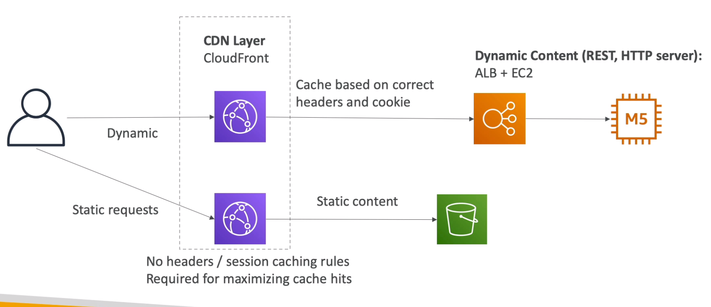
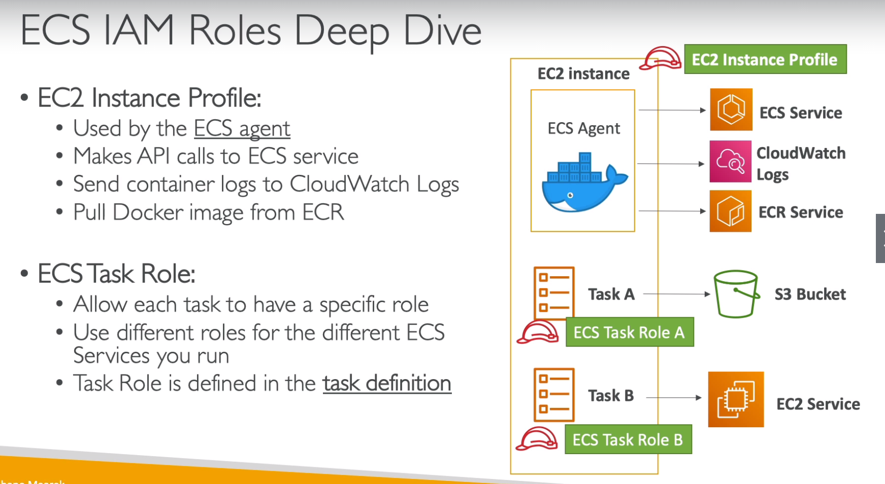

# AWS Certified Developer Associate - DVA-C01

- Download slides at: https://courses.datacumulus.com/downloads/certified-developer-k92/

## IAM + EC2

- Regions: Region is a cluster of data centers. For example: Us East (N. Virginia) us-east-1
- Availability zones: each region has many availabilty zones. One or more discrete data centers with redundant power, networdking and connectivity. They are seperate from each other, so they are isolated from disasters. They're connected with high bandwidth, ultra-low latency networking. For example: us-east-1a
- There are regional services like EC2 and global services like IAM
- IAM
    - IAM (Identity and Access Management) can set
        - Users: physical person
        - Groups: teams
        - Roles: internal usage within AWS resources
        - Policies
    - Root account is account used to create AWS account
    - Best to give users the minial amount of permissions they need to perform their job
    - IAM Federation: used by big enterprises so employees can login into AWS using their company credentials. Uses SAML standard (Active Directory)
    - Avoid using root account and make IAM account for adminstrator
    - Hands on
        - Create IAM User
            - Add user -> Add username -> Give programmatic access and AWS management Console access -> (attach essiting policies: administratorAccess) -> Create user
        - Use Group to assign permissions
            - manage groups -> create new group -> administratorAccess -> Create group
            - add users to group
            - click on particular user and detach AdminstratorAccess which is attached directly, since it is now part of the group and it is more manageable and is attached from group
- EC2
    - Consists of
        - Renting virtual machines (EC2)
        - Storing data on virtual drives (EBS)
        - Distributing load across machines (ELB)
        - Scaling the services using an auto-scaling group (ASG)
    - Security Groups: control how traffic is allowed into or out of our EC2 machines. Basically firewalls of EC2 instances
        - Inbound: traffic coming into
            - Port 22 allows ssh
        - Outbound: traffic going out
        - Authorized IP ranges: IPv4 and IPv6
        - Can be attached to multiple instances. Lives outside of EC3 instance
        - Locked down to a region / VPC combination
        - Its good to maintain one seperate security group for SSH access
        - If timeout then its security group issue
        - All inbound traffic is blocked by default, all outbound traffic is authorised by default
        - Able to authroize security groups as inbound traffic
    - Private vs Public IP (IPv4)
        - IPv4 is more common than IPv6(newer, IoT)
        - Public IP: machine can be identified on the internet. IP unique. Can be geolocated easily
        - Private IP: machince can be identified in the public network. IP must be unique across the private network. Machines connect to WWW using an internet gateway
        - Elastic IPs: when start and stop EC2 instance it changes its public IP. To have a fixed public IP an Elastic IP is needed
            - Avoid Elastic IP because
                - Often reflect poor architectural decisions
                - Instead, use a random public IP and register a DNS(route53) name to it
                - Or use a Load Balancer and dont use a public IP
    - EC2 User Date
        - bootstrap instances using an EC2 User data script. Launches commands when a machine starts only once
        - Automate boot tasks such as
            - Installing updates, installing software, downloading common files etc
        - EC2 User Data Script runs with the root user
    - EC2 Instance Launch Types
        - On Demand Instances: short workload, predictable pricing
            - Pay for what you use
            - Has highest cost but no upfront payment
            - No long term commitment
            - Recommended for short-term and un-interreupted workloads
        - Reserved: minimum 1 year
            - Reserved Instances: long workloads
                - upto 75% discount compared to On-demand, pay upfront, recommended for steady state usage applications (think database)
            - Covertible Reserved Instances: long workloads with flexible instances
                - can change the EC2 isntance type
            - Scheduled Reserved Instances: example - every Thursday between 3 and 6 pm
                - launch within time window you reserve. When you require fraction of a day / week / month
        - Spot Instances: short workloads, for cheap, can lose instances (less reliable)
            - 90% discount compared to on demand
            - Instances that you can "lose" at any point of time if your max price is less than the current spot price
            - The most cost-efficient on AWS
            - Useful for workloads that are resilient to failure. Anything that is possible to retry like batch jobs, data analysis. Bad for critical jobs or databases
            - Great combo: Reserved instances for baseline + On-Demand & Spot for peaks
        - Dedicated Instances: no other customers will share your hardware
        - Dedicated Hosts: book an entire physical server, control instance placement
            - Full control of EC2 instance placement, allocated for your account for a 3 year period reservation, more expensive. Useful for software that have complicated licensing model. Or for companies that have strong regulatory or compliance needs
    - Elastic network Interfaces (ENI)
        - logical component in a VPC that represents a virtual network card
        - ENI can have
            - Primary private IPv4, one or more secondary IPv4
            - One Elastic IP (IPv4) per private IPv4
            - One pulbic IPv4
            - One or more security groups
            - A MAC address
        - Bound to specific availability zone
        - Can create ENI independently and attach them on the fly (move them) on EC2 instances for failover
    - Custom AMI can be created for faster boot time(no need for long ec2 user data at boot time), pre-install packages needed, etc. AMI are built for a specific AWS region
    - M instance are instance types that are mixed
    - T2/T3 instance types are "burstable"
        - Burst means that overall, the instance has OK CPU performance
        - Whtn the machine needs to process something unexpected it can burstm abd COU can be very good
        - It the machine bursts, it utilizes "burst credits". If all the credits are gone, the CPU becomes BAD.
        - If the machine stops bursting, credits are accumulated over time
    - Hands on
        - Remeber to set region
        - Launch instance
            - Click launch instance -> Set Amazon Machine Image (AMI) select Amazon Linux 2 AMI -> step 3: network : defulat vpc, subnet says in which availability zone we want our instance to be -> Step 4: storage (EBS): defines where OS will be -> Step 5: Add tags: set Name -> Step 6: Configure Security group: create a new security group 0.0.0.0/0 (means any IP) -> Launch -> Key pair allows to ssh so create a new key pair and download key pair
        - SSH
            - (Only windows, for linux based use chmod) Right click on PEM file -> security -> Make yourself owner -> Remove all other user except yourself
            - Click on ec2 instance -> connect
        - Set Elastic IP
            - EC2 console -> In menu under network and security click Elastic IP -> Allocate Elastic IP address -> Allocate -> Actions -> Associate Elastic IP Address -> Choose instance -> Associate
            - Need to release elastic IP address from actions if it is not in use and linked to an instance
        - Install Apache on EC2
            ```sh
            #!/bin/bash
            sudo su
            yum update -y
            yum install -y httpd.x86_64
            systemctl start httpd.service
            systemctl enable httpd.service
            ```
            - Go to security rules to allow inbound port 80. Http, tcp, 80, 0.0.0.0/0
            - Go to public IP address on browser {public_ip}:80
            - `echo "Hello World from $(hostname -f)" > /var/www/html/index.html`
        - EC2 User Data
            - Launch new instance -> Step 3: Configuring Intsance Details: Advanced Details: As text: add install apache script
        - ENI
            - Create 2 instances in the same availability zone -> once created network interfaces says eth0, hover over it and go to interface id
            - Menu in EC2 console -> Under network and security menu (network interfaces) -> create network interface -> make sure its in the same subnet -> Attach security group -> right click on it and attach it to one of the instance. Now that instance has to private IP
    
## ELB + ASG

- Scalability means that an application / system can handle greater loads by adapting
- Types of scalability
    - Vertical: increasing size of the instance. Common for database. Ex: t2.micro -> t2.large
    - Horizontal: increasing number of instances / systems for your application. Common for web applications. Ex: 1 t2.micro -> 4 t2.micro
- High Availability: goes hand in hand with horizontal scaling. High availability means running application in at least 2 data centers. Goal is to survive a data center loss
- Elastic Load Balancer (ELB)
    - Load balancers are servers that forward internet traffic to multiple servers (EC2 instances)
    - Why use load balancers
        - Expose singple point of access (DNS) to application
        - Seamlessly handle failures of downstream instances
        - Provide ssl termination for your websites
        - Enforce stickiness with cookies
        - High availability across zones
        - Seperate public traffic from private traffic
    - ELB is a managed load balancer. This means AWS will take care a lot of things
    - Health checks are crucial for load balancers. They enable the load balancer to know if instances it forwards traffic to are available to requests. The health check is done on a port and a route(/health is common). If response is not 200 then the instance is unhealthy
    - Type of load balancer on AWS. Application Load Balancer or Network Load Balancer is preferred
        - Classic Load Balancer (2009): HTTP, HTTPS, TCP
        - Application Load Balancer (2016): HTTP, HTTPS, WebSocket
            - Load balancing to multiple HTTP applications across machines
            - Load blancing to multiple applications on the same machine (ex: containers)
            - Redirect HTTP to HTTPS
            - Routing tables to different target groups
                - Routing based on path in URL
                - Routing based on hostname in url
                - Routing based on query string, headers
            - ALB are a great fit for micro services & container-based application
            - Application servers don't see the IP of the client directly
                - The true IP of the client is inserted in the header X-Forwarded-For
        - Network Load Balancer (2017): TCP, TLS (secure TCP) & UDP
            - handle millions of request per seconds
            - Less latency ~100 ms (vs 400 ms for ALB)
            - NLB has one static IP per AZ, and supports assigning Elastic IP
            - NLB are used for extreme performance, TCP or UDP traffic
    - NLB expose a public static IP, whereas ALB or CLB exposes a static DNS (URL)
    - Can set internal or external ELBs
    - Load balancer stickiness: same client is always redirected to the same instance behind a load balancer
        - Only works for CLB and ALB
        - The "cookie" used for stickiness has an expiration date you control
        - Make sure the user doesnt lose his session data
        - Enabling stickiness may bring imbalance to the load over the backend EC2 instances
    - Cross-Zone Load Balancing: each load blancer instance distributes evenly across all registered instances in all AZ
        - Otherwise distributes requests evenly across the registered instances in its AZ only
        - CLB: disabled by default, no charges for inter AZ data if enabled
        - ALB: always on, no charges for inter AZ data
        - NLB: disabled by default, pay charges for inter AZ data if enabled
    - ELB: SSL Certificates
        - SSL certificate allows traffic between your clients and your load balancer to be encrypted in transit (in-flight encryption)
        - TLS refers to transport Layer Security, which is newer version of SSL. TLS certificates is mainly used, people still refer to it as SSL
        - Can manage sertificates using ACM (AWS Certificate Manager)
        - SNI (Server Name Indication): solves loading multiple SSL certificates onto one web server (to server multiple websites). Only works for ALB, NLB, CloudFront
    - ELB: Connection Draining
        - Connection draining is the time to complete "in flight requests" while the instance is de-registering or unhealthy. ELB stops sending new requests to the instance which is de-registering
        - CLB: Connection Draining
        - Target Group: Deregistration Delay for ALB & NLB
    - Hands On
        - ELB security groups
            - inbound load balancer[Http, tcp, 80, 0.0.0.0/0], [Https, tcp, 443, 0.0.0.0/0]
            - inbound ec2 [http, tcp, 80, security group id] 
        - Classic Load Balancer (CLB)
            - EC2 console -> Menu (load balancing: Load balancers) -> create load balancer (CLB) -> Give name and VPC -> Assign security group [custom tcp, tcp, 80, 0.0.0.0/0] -> Go to DNS name
            - Can still go to website without Load balancer to fix: Security group for inbound ec2 instance -> change to [http, tcp, 80, security group id]
            - Add another instances to load balancer: Go to oad balancers in menu -> Instances -> edit instances
        - Application Load Balancer (ALB)
            - EC2 console -> Menu (load balancing: Load balancers) -> create load balancer (ALB) -> Give name and scheme is internet facing, select VPC and AZ -> Assign security group [custom tcp, tcp, 80, 0.0.0.0/0] -> Step 5: Register targets: select instances
            - Can still go to website without Load balancer to fix: Security group for inbound ec2 instance -> change to [http, tcp, 80, security group id]
            - If 503 error then something wrong with target group. Go to target groups in menu -> targets -> edit -> add instances -> add to registered -> save
            - In order to set rules go to listeners for load balancers -> view/edit rules -> Edit and then can insert rule based on header, path, query string. This can also be used to route to multiple target groups
        - Network Load Balancer (NLB)
            - EC2 console -> Menu (load balancing: Load balancers) -> create load balancer (NLB) -> Give name and scheme, set AZ -> Step 3: Set target group as instance -> Step 4: Addd to registered the instances -> Create
            - For NLB instances see that traffic is coming from outside not the load balancer: go to target group attached to it, all the targets are unhealthy -> go to one of the instance and to the security group -> add rule [Custom TCP, TCP, 80, 0.0.0.0/0] -> wait health checks to pass
        - Load balancer stickiness (ALB)
            - Go to target group for load balancer -> Edit attributes -> Stickiness enabled -> Set duration -> Save
        - CLB SSL
            - Go to load balancer -> listeners -> and do all operations there
- Auto Scaling Group (ASG)
    - Scale in/out to match an increased/decreased load
    - Automatically register new instances to a load balancer
    - ASG has:
        - Launch configuration
            - AMI + Instance Type, EC2 user date, EBS volumes, securtiy groups, SSH key pair
        - Min size . max size / initial capacity
        - network + subnets Information
        - Load balancer information
        - Scaling Policies
    - Auto scaling alarms
        - Possible to scale ASG based on CloudWatch alarms
        - Metrics are computed for the overall ASG instances
    - To update an ASG, must provide a new launch configuration / launch template (newer)
    - Having instances under ASG measn that if they are terminated the ASG will automatically create new ones as a replacement
        - EC2 can be terminated if marked unhealthy by load balancer
    - Auto scaling groups - scaling policies
        - Types
            - Target tracking scaling
                - Easiest to set up
                - Example: want the average AASG CPU to stay at around 40%
            - Simple / Step Scaling
                - When a CloudWatch alarm is triggered then perform action
            - Scheduled Actions
                - Anticipate a scaling based on known usage patterns
        - Cooldown period helps to ensure that your ASG doesnt launch or terminate additional instances before the previous scaling activity takes effect
            - Scaling specific cooldown period overrides the default cooldown period
            - If application is scaling up and down multiple times each hour, modify the ASG cool-down timers and the CloudWatch Alarm Period that triggers the scale in
    - Hands on
        - Set up Autoscaling
            - EC2 console -> left menu auto scaling groups -> create autoscaling group -> enter name and create launch template -> add name, version, select ami, select instance type, select key-pair, select security group, in advanced details add user data -> create launch template
            - In ASG console select the template created in the previous step -> next -> select subnets -> next -> enable load balancing, select target group -> next -> set group size -> next, next, next, create auto scaling group
        - Scaling policies
            - EC2 dashboard -> auto scaling groups -> select group -> automatic scaling -> scaling policies (add) -> select policy and other fields. The rules can be seen in cloudwatch

## EBS + EFS

- EBS (Elastic Block Store)
    - is a network drive you can attach to your instance while they run
    - If EC2 machine terminated then loses root volume. EBS allows you to store your instance data somewhere. EBS allows to persist data
    - Uses network to communicate with the instance, which means there is some latency
    - It can be fetached from an EC2 instance and attached to another one quickly
    - It is locked to an AZ. To move across, you need to first need to snapshot it
    - Charged for amount of gigabytes provisioned
    - Types
        - GP2 (SSD): general purpose ssd
            - Recommended for most workloads
            - Least expensive for ssd
        - IO1 (SSD): highest performance ssd, low latency or high throughput
            - critical business applications
            - >16000 IOPS(Input/Output operations per second) per volume
            - Critical database
        - STI (HDD): low cost designed for frequently accessed, throughput-intensive workloads
            - Streaming workloads requiring consistent, fast throughput at low price
            - Big data
        - SC1 (HDD): lowest cost designed for les frequently accessed workloads
            - Storage of data that is infrequently accessed
    - Only GP2 and IOI can be used as boot volumes
    - EBS vs Instance store
        - Instance store = ephemeral storage. Instance store is physically attached to the machine. EBS is a network drive
        - Pros for instance store:
            - Better I/O performance
            - Good for cache
            - Data survives reboots
        - Cons for instance store:
            - On stop or termination, the instance store is lost
            - Can't resize instance store on fly
            - Backups must be operated by the user
    - Hands on
        - Create EBS
            - EC2 console -> launch instance -> Step 4: Add storage EBS can be set up here
            - Left side menu (elastic Block Store: Volumes)
            - `lsblk` on terminal lets to see EBS attached. EBS can be mounted on different folders
        - Create Instance store
            - EC2 console -> launch instance -> step 2: choose an instance type -> in the instance type column look for something that has instance store
- EFS (Elastic File System)
    - Managed NFS (network file system) that can be mounted on many EC2, and unlike EBS can be mounted on multiple-AZ
    - Highly available, scalable. Pay per use. So if less data this might be cheaper than EBS
    - EBS linked to one EC2 instance while EFS can be shared at the same time
    - Use cases: content management, web serving, data sharing
    - Compatible with Linux based AMI
    - Encryption at rest using KMS
    - Performance and Storage classes
        - EFS scale: thousands of concurrent NFS client
        - Performance
            - General purpose: latency-sensitive use cases
            - Max I/O: higher latency, throughput, highly parallel
        - Storage (lifecycle management feature - move file after N days)
            - Standard: for frequently accessed files
            - Infrequent access (EFS-IA): files less accessed, lower price to store but higher price for retrieval
    - Hand-on
        - Create EFS
            - EFS console -> create file system -> customize to look into things or else click create (security group: inbound NFS and security group of ec2 instance) -> create ec2 instance that accesses file system (can be done in step 3), different security group for ec2
        - EC2 to file system manually
            - EFS console -> attach -> Mount by DNS -> EFS mount helper -> go to user guide and install amazon utils package
- EBS vs EFS
    - EBS: only one instance at a time and locked in at AZ level. Migrating means taking a snapshot and restore snapshot into another AZ. EBS volume terminated if EC2 terminated
    - EFS: mounted across different instances across different AZs. Only for linux. Can share files. Generally more expensive than EBS. Can use EFS-IA for cost savings
    - Instance store physically attached to EC2 and therefore very fast IO. Something like database

## RDS + Aurora + ElastiCache

- RDS (Relational Database Service)
    - Managed DB service, use SQL. Supported: Postgres, MySQL, MariaDB, Oracle, Microsoft SQL Server, Aurora
    - Since it is managed we chose it over running it over EC2
        - Automatic provisioning
        - Continuous backups
            - Automated. Done daily. Transaction logs backed up every 5 min. Therefore can restore to any point in tome (from older to 5 min ago). 7 day retention but can be increased to 35 days
            - DB snapshots are also available and manually triggered by the user. Retention of backup as long as you want
        - Monitoring dashboard
        - Multi AZ setup for DR (disaster Recovery)
        - Storage backed by EBS
        - But we cannot SSH into RDS
    - Read replica help scale read. Can create upto 5 read replica, (within az, cross az or cross region), replication is async so reads are eventually consistent, replicas can be promoted to their own DB
        - Network cost: when data goes from AZ to another. Cost can be mitigated is read replica in the same AZ, network cost is free
        - Multi az (disaster recovery)
            - sync replication happens instantly. Application talks to one dns name. If failover in master then talks to other database (standby database). Increase availability. Not used for scaling. Standby database is for standby and for failover. Read replicas can be set up as multi az
    - RDS security - Encryption
        - At rest encryption (data not in movement): possibility to encrypt the master & read replicas with AWS KMS - AES-256 encryption
            - Has to be defined at launch time
            - If master not encrypted, the read replicas cannot be encrypted
            - Trasparent Data Encryption (TDE) available for Oracle and SQL server
        - in Flight encryption (SSL certificates): to encrypt data to RDS in flight
            - Enfore SSL
                - PostgreSQSL: rds.force_ssl=1 in the AWS RDS console
                - MySQL: GRANT USAGE ON *.* TO 'mysqluser\@%' REQUIRE SSL;
    - RDS Encruption Operations
        - Encrypting RDS backups
            - snapshots of un-encrypted RDS database are unencrypted
            - snapshots of encrypted RDSD databases are encrypted
            - Can copy a snapshot into an encrypted one
        - To encrypt an unencrypted RDS database
            - create a snapshot of the unencrypted database
            - Copy the snapshot and enable encryption for the snapshot
            - Restore the database fro the encrypted snapshot
            - Migrate applications to the new database, and delete the old database
    - RDS Security - Network and IAM
        - Network Security
            - RDS databases are usually deployed within a private subnet, not a public one
            - RDS security works by leveraging security groups (same as EC2) - it controls which IP / security group can communicate with RDS
        - Access Management
            - IAM policies help control who can manage AWS RDS
            - Traditional Username and Password can be used to login the database
            - IAM based authentication can be used for MySQL and Postgres
    - Hand on
        - Create database
            - rds console -> databases tab -> create database
            - Instancs tab has connect endpoint
- Aurora
    - AWS proprietary. Compatible with Postgres and MySQL. Cloud optimized
    - Aurora storage automatically grows
    - 20% for costly but very efficient
    - 6 copies of data across 3 AZ
    - Can have 15 read replicas and any of them can become master if it failes. Automated failover for master is less than 30 seconds
    - Has a thing called self healing
    - Aurora DB Cluster
        - Writer endpoint: pointing to the master
        - Reader endpoint: connecting to load balancing. Which is connected to read replicas that auto expands
        - Shared storage volume that auto expands
    - Security
        - Similar to RDS
        - Encryption at rest using KMS, automated backups and snapshots, encryption with SSL, possiblity to authenticate usin IAM
    - Serverless
        - Automated database instantiation and auto-scaling based on actual usage 
        - Good for infrequent, intermittent or unpredictable workloads
        - No capacity planning needed
        - Pay per second can be more cost-effective
    - Global
        - Aurora cross region read replicas: useful for disaster recovery
        - Global Database: 1 primary region (read/write), upto 5 seconds (read-only) regions, replication lag is lass than 1 second
        - Promoting another region has an RTO of <1 minute
    - Hands on
        - Create Database
            - RDS console
- ElastiCache
    - Overview
        - ElastiCache is to get managed Redis or Memcached
        - In-memory databases with really high performance, low latency
        - Help reduce load off of databases for read intensive workloads
        - Helps make application stateless
        - Write scaling using sharding
        - Read scaling using Read Replicas
        - Multi AZ with Failover Capability
    - ElastiCache can be used to do user session store
        - application writes the session data into ElastiCache
        - The user hits another instance of our application
        - The instance retrieves the data and the user is already logged in
    - Redis vs memcached
        - Redis (like RDS): Multi AZ with Auto-Failover, read replicas to scale reads and have high availability, data durability using AOF persistence, backup and restore features
        - Memcached: Multi-node for partitioning of data (sharding), non-persistent (if node goes down, data is lost), no backup and restore, multi-threaded architecture
    - Caching Implementation Considerations
        - Design Pattern
            - Lazy Loading / Cache-Asige / Lazy Population
                - application asks cache
                - if hit fetch from cache
                - if miss then fetch from RDS and then write to cache
                - Pros: only requested data cached, node failures are not fatal (increased latency to warm the cache)
                - Cons: for cache miss 3 round trips, stale data might exist in the cache
            - Write through
                - application asks cache
                - if hit fetch from cache
                - on write to database, a write to cache is also made
                - Pros: data in cahce is never stale, write penalty vs read penalty (each write requires 2 calls)
                - Cons: missing data until RDS is updated. Cache churn - a lot of the data will never be read
        - Cache eviction
            - Caches can be deleted explicitly
            - item is evicted because the meory is full and its not receuntly used (LRU)
            - you set an item time-to-live (or TTL)
    - Hands on
        - Create Elasticache
            - elasticache console -> Get starded now -> create

## Route 53

- Route53 is managed DNS
- DNS is collection of rules and records which helps clients understand how to reach a server through its domain name
- Most common records
    - A: hostname to IPv4
    - AAAA: hostname to IPv6
    - CNAME: hostname to hostname
    - Alias: hostname to AWS resource
- Route53 can use public and private domains
- Route53 features
    - Load balancing
    - Health checks
    - Routing policy: simple, failover, geolocation, latency, weighted, multi value
- TTL (Time to Live)
    - web browsers and client to cahce DNS query. This is so queries are not made to route 53 to get the A record. The IP will be stored in the browser till TTL expires
        - High TTL: about 24 hours. Less traffic on DNS. Posibly outdated records
        - Low TTL: about 60 s. More traffic on DNS. Records are outdated for less time. Easy to change records
    - TTL is mandatory for eac DNS record
- ELB is used to load balance in a single region. Route 53 intended to help balance traffic across regions
- CNAME vs Alias
    - CNAME: hostname -> hostname
        - Only for non root domain (ex: something.mydomain.com)
    - Alias (type A record): hostname -> AWS resource
        - Works for root and non root domain
        - Free of charge
        - Native health check
- Routing Policies
    - Simple Routing
        - Web browser asks for domain and Route 53 returns A record
        - Use when you need to redirect to a single source
        - Can't attach health checks to simple routing policy
        - If multiple values are returned, a random one is chosen by client. This can be used to do clientside loadbalancing
    - Weighted Routing
        - Control the % of the requests that go to specific endpoint
        - Helpful to test a certain percent of traffic on a new app version
        - Helpful to split traffic between two regions
        - Can be associated with health checks
    - Latency Routing
        - Most often the most suitable routing policy
        - Redirect to the server that has the least latency close to us
        - Latency is evaluated in terms of user to designated AWS region
    - Health Check
        - deemed unhealthy if fails 3 checks in a row
        - default health check interval 30s
        - integrate these health check with cloudwatch
    - Failover Routing Policy
        - There is route53 and two ec2 instances: primary, secondary(disaster recovery)
        - Health check for primary and if it fails then failover to secondary
    - Geolocation Routing
        - Routing based on user location
        - Need to create a default policy in case there's no match on location
    - Multi value routing policy
        - use when routing traffic to multiple resources
        - want to associate a route 53 health checks with records
        - basically simple routing with health checks
        - up to 8 healthy records returned for each multi value query
        - multi value is not a substitue for having an elb
- Hands on
    - Create route53
        - Route53 console -> register domain -> create A record to point DNS to ip
            - To check ip from terminal `dig {website}`
    - TTL Record
        - Route 53 -> create record set has option for TTL
    - Simple routing
        - Multiple IP values can be placed and the browser will pick one
    - Weighted Routing
        - Enter IP in value, set routing policy as weighted, set weight, and set a name in ID, need to create multiple
    - Latency Routing
        - Routing policy latency, set region and set instance, need to create multiple
    - Health check
        - Route 53 health check -> create health check
    - Failover routing
        - Hosted zone -> create record set -> then set routing policy
    - Geolocation routing
        - In hosting zone create record -> routing policy geolocation

## Virtual Private Cloud (VPC)

- **VPC**: private network to deploy your resources (regional). Set of IP range called CIDR range
- **Subnets**: allow you to partition your network inside your VPC (AZ resource)
    - **Public subnet**: is a subnet that is accessible from the internet
    - **Private subnet**: is a subnet that is not accessible from the internet
- **Route table**: define access to the internet and between subnets
- **Internet Gateways (IGW)**: helps VPC instances connect with the internet
    - Public subnets have a route to the internet gateway
- **NAT Gateway (managed) & NAT instances (self-managed)**: allow instances in your private subnets to access the internet while remaining private
    - Deploy NAT to public subnet. Private subnet connects to NAT and NAT coonnects to Internet Gateway
- **NACL (Network ACL)**: a firewall which controls traffic from and to subnet
    - Can have ALLOW and DDENY rules
    - Are attached at the Subnet level
    - Rules only include IP addresses
    - First mechanism of defense of public subnet
- **Security Groups**: firewall that controls traffic to and from an EC2 instance
    - Can have only ALLOW rules
    - Rules include IP addresses and other security groups
    - Operates at instance level
- Traffic goes from web -> nacl -> security group -> EC2 instance
- **VPC Flow logs**: capture information about IP traffic going into your interfaces
    - Helps to monitor & troubleshoot connectivity issues
- **VPC Peering**: connect two VPC, private using AWS's network
    - Make them behave as if they were in the same network
    - Must not have overlapping CIDR (IP address range)
    - VPC Peering connection is not transitive (must be established for each VPC that need to communicate with one another)
- **VPC Endpoints**: Endpoints allow you to connect to AWS Services using a private network instad of the public www network
    - This gives you enhanced security and lower latency to access AWS services
- Site to Site VPN: connect an on-premises VPM to AWS
    - the connections is automatically encrypted
    - Goes over internet
- Direct Connect (DX)
    - Establish a physical connection between on-premises and AWS
    - The connection is private, secure and fast
    - Goes over a private network
- Typical 3 tier solution architecture
    - 

## Amazon S3 Intro

- S3: infinitely scaling storage
    - allows to stores objects(files) in buckets (directories)
    - buckets defined at regional level even though s3 is global
    - naming convention: no uppercase, no underscore, must start with lowercase letter or number
- Object values are the content of the body:
    - max object size is 5 TB
    - if uploading more that 5 GB, must use "multi part upload"
- Versioning
    - Needs to be enabled in bucket level
    - Same key overwrite will increment the version: 1, 2, 3...
    - Best oractice to version your buckets
        - Protect unintended deletes
        - Easy roll back to previous version
    - Any file not versioned prior will have null
    - Deleting puts a delete marker
    - Deleting the marker and one of the files under will permanently delete
- Encryption
    - 4 methods to encrypt objects
        - **SSE-S3**: encrypts S3 objects using keys handled and managed by AWS
            - Object is encrypted server side
            - AES-256 encryption
            - must set certain header "x-amz-server-side-encryption":"AES256"
            - data key is managed by AWS S3
        - **SSE-KMS**: leverage AWS Key Management Service to manage encryption keys
            - data key is managed by KMS
                - Advantages: user control + audit trail
            - Object is encrypted server side
            - must set certain header "x-amz-server-side-encryption":"aws:kms"
        - **SSE-C**: when you want to manage your own encryption keys
            - data key is provided by customer outside of AWS. It is not stored in aws
            - HTTPS must be used
            - encryption key must be provided in HTTP headers, for every HTTP request made because it will be discarded
            - the same key need to be provided to get back the data
        - **Client side encryption**
            - encrypt object before uploading to S3. Library such as Amazon S3 Encryption client
            - decryption is also done on client
            - customer manages key and encryption cycle
- Security
    - User based
        - IAM policies - which API calls are allowed
    - Resources based
        - Bucket policies - bucket wide rules from the S3 console - allows crosst account
            - JSON based policies
                - Resources: buckets and objects
                - Actions: set of API to Allow or Deny
                - Effect: Allow/Deny
                - Principal: The account or user to apply the policy to
        - Object Access Control List (ACL) - finer grain
        - Bucket Access Control List (ACL) - less common
        - Block Public Access
            - block public access to buckets and objects granted through new ACLs, any ACLs, new public bucket or access point policies
            - created to prevent company data leaks
            - if you know bucket should never be public, leave these on
            - can be set at the account level
        - Networking
            - Support VPC endpoint (for instances in VPC without www internet)
        - Logging and Audit:
            - S3 Access Logs can be stored in other S3 bucket
            - API calls can be logged in AWS CloudTrail
        - User Security
            - MFA(multi factor authentication) delete
            - Pre-Signed URLs: urls that are valid only for a limited time
- S3 Website
    - set static website hosting as enabled
- Cors (cross-Origin Resource Sharing)
    - web browser has security built in that it does not allow requests to other origins while visiting the main origin unless it has the appropriate header
- S3 is eventually consistent
    - Might get older version of object if doing get quickly after put/delete
    - No way to request strong consistency
- Hands On
    - Create S3
        - go to s3 -> create bucket (needs to be globally unique in aws) -> choose region even though console is global (s3 is not global, its regional)
        - object actions -> open to see file. This is a private url. This is a presigned url which aws uses to verify credentials
        - object url can be used to view file by pasting the url in the browser. This is public url, so if s3 is not public then it wont be visible
    - Version
        - Go to properties -> Bucket versioning -> enabled
    - Encryption
        - click on file -> server-side-encryption setting -> shows encryption settings
        - when uploading files -> advanced settings has encryption option -> set encryption there
        - bucket can have default encryption options -> go to properties in bucket and scroll to encryption settings
    - S3 bucket policies
        - permissions -> bucket policy -> policy generator -> remember to add /* at end of ARN to apply to all objects
    - S3 website
        - upload files -> properties -> static website hosting to enabled
        - permissions -> dont block public access -> write bucket policy that allows public access
    - S3 Cors
        - if contents in different buckets -> permissions -> CORS settings

## AWS CLI, SDK, IAM Roles & Policies

- need to install aws cli
- configure cli
    - get access credentials from IAM -> users -> security credentials -> create access key
    - `aws configure` -> paste id and key
- aws cli on ec2
    - use aws iam roles
        - can be attached to ec2 instances
        - can come with a policy authorizing exactly what the ec2 instance should be able to do
    - ec2 -> ssh into public ip -> `aws configure` and do not put id and key -> go to iam, create role, attach to aws service, get a managed policy -> right click on ec2 instance and attach iam role
- inline policy is added on top off what is chosen. Not possible to be added to other roles. NOT RECOMMENDED. Globabl policies are better for management
- google `aws policy simulator` to test policies
- some aws cli commands (not all) contain a `--dry-run` option to simulate API calls
- to decode what the error message means when running commands from the cli use: `sts decode-authorization-message`
- ec2 instance metadata
    - allows ec2 instances to learn about themselves without using an IAM Role for that purpose
    - `http://169.254.169.254/latest/meta-data/`: use in ec2 instance to get IAM role name
- cli profile
    - create profile: `aws configure --profile [profile-name]`
    - function against profile: `aws s3 ls --profile [profile-name]`
- MFA with cli
    - `aws sts get-session-token`: pass in mfa token from device
- aws sdk: sdk we use to perform actions on AWS directly from applications code
    - if region not specified, then us-east-1 is selected by default
- AWS limits
    - api rate limits
    - service quotas: how many resources of something we can run
- Exponential Backoff is a throttling mechanism. API call duration is doubled everytime it fails
- AWS credentials provider chain. CLI looks for credentials in order: command line options -> environment variables -> cli credentials files -> cli configuration file -> container credentials -> instance profile credentials
- Never store credentials in code. Use IAM roles. If working outside of AWS then use env variables / named profiles.
- SigV4 is signing requests when sending to aws. All api requests need to be signed
- AWS Cli depends on python

## Advanced S3 & Athena

- MFA Delete
    - Need to enable versioning. Need MFA to delete an object version or suspend versioning on the bucket
    - can only be done through cli
- S3 Access Logs
    - any request made to s3 from any account, authorized or denied, can be logged
    - analysis on this data can be done through Amazon Athena
    - Do not set your logging bucket to be the monitored bucket as it will create a logging loop and bucket will grow in size exponentially. Seperate application and logging bucket
- S3 Replication: replicate bucket from one region to another regiion. Must enable versioning in source and destination. Copying is asynchronous. Must give proper IAM permissions to S3. After activating only new objects are replicated. Deletes not replicated
    - CRR(Cross region replication). Use cases: compliance, lower latency access, replication across accounts
    - SRR(Same region replication). Use cases: log aggregation, live replication between production and test accounts
- S3 Presigned url
    - can generate it using sdk or cli
        - downloads is easy and can be done using cli
        - uploads is harder and must use sdk
    - presigned url valid for 3600 default and can be changed by passing parameters
- S3 Storage classes
    - Amazon S3 standard: general purpose
        - high durability, availability, can sustain 2 concurrent facility failures
        - use cases: big data analytics, mobile & gaming applications, content distribution
    - Amazon S3 Standard-infrequent Access (IA): when files infrequently accessed
        - suitable for data that is less frequently accessed, but requires rapid access when needed
        - low cost compared to S3 standard
        - use cases: data store for disaster recovery, backups
    - Amazon s3 One zone-infrequent access: when we can recreate the data
        - data is stored in a single AZ
        - high durability, but if AZ is destroyed then data lost
        - low latency and high throughput
        - SSL for data at transit and encryption at rest
        - low cost compared to IA (by 20%)
        - use cases: storing secondary backup copies of on premise data, or storing data you can recreate
    - Amazon S3 intelligent tiering: move data between storage classes intelligently
        - low latency and high throughput performance of S3 standard
        - small monthly monitoring and auto-tiering fee
    - Amazon Glacier: archieves
        - low cost object storage meant for archiving/backup
        - data is retained for the longer term (10s of years)
        - very cheap
        - archieves are stored in vaults not buckets
        - types of glacier
            - glacier. Minimum storage duration 90 days
                - Expedited (1 to 5 minutes retrieval)
                - Standard (3 to 5 hours retrieval)
                - Bulk (5 to 12 hours retrieval)
            - Amazon Glacier Deep Archieve: archieves not needed right away. Much cheaper. Minimum storage 180 days
                - standard (12 hours retrieval)
                - bulk (48 hours retrieval)
- S3 Lifecycle rules
    - you can transition objects between storage classes
    - moving objects can be automated using a lifecycle configuration
    - transition actions: defines when objects are transitioned to another storage class
    - expiration actions: configure objects to expire (delete) after sometime
        - can be used to delete old versions of files (if versioning enabled)
        - can be used to delete incomplete multi-part uploads
- S3 Baseline Performance
    - scales to high requests rates and low latency
    - if you use SSE-KMS, you may be impacted by the KMS limits (KMS quota per second varies by region)
        - when you upload it called the generateDataKey KMS API
        - when you download it called the decrypt kms api
    - optimize
        - multipart upload: recommended for files > 100 MB, must for files > 5 GM. Can help parallelize uploads (speed up transfer)
            - ie file is split into multiple parts and all uploaded simultaneously. AWS is smart enough to combine all these files once they are uploaded
        - S3 transfer acceleration (upload only): increase transfer speed by transferring file to an AWS edge location which will forward the data to the S3 bucket in the target region
            - ie file from usa -> edge location -> s3 bucket in australia (fast private aws network is used to send data here)
        - S3 Byte range fetches: parallelize GETs by requesting specific byte ranges. Better resilience in case of failures
            - can get partial amount of file
            - speed up downloads
- S3 select & glacier select
    - sql queries can be performed on s3 to filter by rows and columns. Less network transfer, less CPU cost client-side. Filtering is done server side
- S3 Event notifications: once there is an S3 event like file upload or delete certain tools can be triggered. Versioning must be enabled for this
    - SNS: send notification by emails
    - SQS: simple queue service
    - lambda function
- AWS Athena
    - Serverless service to perform analytics directly against S3 files
    - uses sql language to query the files
    - charged per query and amount of data scanned
    - supports csv, json, orc, avro and parquet
    - Use cases: Business intelligence/ analytics, VPC Flow Logs, ELB Logs, Cloudtrail trails
    - Anytime data needs to analyzed on S3 use Athena
- S3 Object lock & glacier vault lock
    - S3 object lock
        - Adopt WORM (Write Once Read Many) model. Block an object version deletion for a specified amount of time
    - Glacier Valut Lock
        - Adopt WORM (Write Once Read Many) model. Lock the policy for future edits (can no longer be changed) for a specified amount of time
        - Helpful for compliance and data retention
- Hands On
    - S3 Access Logging
        - properties of bucket -> server access logging to enabled and then select target bucket. This bucket now gets write access to the other bucket. Remember to make seperate application and logging bucket
    - S3 Replication
        - enable bucket versioning in source and target bucket -> management in bucket -> replication rules. Files before replication rules set will not be replicated. Only newer objects will be
    - Presigned url
        - `aws s3 presign s3://mybucket/myobject --expires-in 300 --region my-region`
    - Storage classes
        - additional upload options when uploading a file. Storage classes of objects can be changed later as well
    - Lifecycle role
        - management -> lifecycle role
    - S3 bucket notification
        - properties -> event notifications
    - Athena
        - set query results location in athena
        - look up `how do i analyze my amazon s3 server access logs using athena` to learn how to do queries

## AWS Cloudfront

- Cloudfront is a CDN
    - improves read performance as content is cached at the edge
    - It gives DDos protection, integration with Shield, AWS Web Application Firewall
    - Can expose external HTTPS and can talk to internal HTTPS backends
    - request from cdn to resource is done over private network
- CloudFront Origins (put cloudfront in front of)
    - S3 Bucket
        - For distributing files and caching them at the edge
        - Enhanced security with CloudFront Origin Access Identity (OAI)
        - CloudFront can be used as an ingress (to upload files to S3)
    - Custom Origin (HTTP)
        - Application Load Balancer
        - EC2 instance
        - S3 Website
        - Any HTTP backend
- Cloudfront has Geo Restriction. We can have whitelist and blacklist for countries
    - Use case: Copyright Laws
- Cloudfront vs S3 Cross Region Replication
    - Cloudfront
        - Global Edge Network
        - Files are cached for a TTL (maybe a day)
        - Great for static content that must be available everywhere. We are okay if content outdated a little bit
    - S3 Cross Region Replication
        - Must be setup for each region you want replication tohappen
        - Files are updated in near real time
        - Read only
        - Great for dynamic content that needs to be available at low-latency in few regions
- Cloudfront Caching
    - Cache based on
        - Headers
        - Session Cookies
        - Query String Parameters
    - Want to maximize the cache hit rate to minimize requests on the origin
    - Control the TTL (0 seconds to 1 year) using Cache-Control headers
    - can invalidate part of the cache using the CreateInvalidation API
    - maximize cache hits by separating static and dynamic distributions
    - 
- Cloudfront Security
    - Cloudfront Geo-restriction: allow whitelist and blacklist for countries
    - HTTPS
        - viewer protocol policy
            - between client and edge location
            - redirect HTTP to HTTPS or use HTTPS only
        - Origin protocol policy (HTTP or S3)
            - between edge location and origin
            - HTTPS only or match viewer
- Cloudfron signed url/signed cookies
    - use case: you want to distribute paid shared content to preium users over the world
    - attach policy with url and cookie:
        - inclides url expiration
        - includes IP ranges to access the data from
        - trusted signers (which AWS accounts can create signed URLs)
    - how long should the url be valid for:
        - shared content then make valid time low
        - private content then make valid time last for years
    - Signed URL: access to individual files (one signed URL per file)
    - Signed Cookies: access to multiple files (one signed cookie for many files)
    - cloudfront signed url vs s3 pre-signed url
        - Cloudfront signed url
            - allows access to a path, no matter the origin
            - account wide key pair, only the root can manage it
            - can filter by IP, path, data, expiration
            - can leverage caching features
        - S3 pre-signed url
            - issue a request as the person who pre-signed the url
            - uses the IAM key of the signing IAM principal
            - limited lifetime
- Hands on
    - Cloudfront with S3
        - create s3 bucket with some files uploaded -> create distribution on cloudfront -> get started with web type of distribution -> no need for origin path, request bucket access = yes, yes update bucket policy -> go to cloudfront link, it will redirect to S3 which is not an error will take a few hours for DNS to propogate properly
    - Invalidate cache
        - Cloudfront -> behaviours -> edit -> can see minimum/maximum/default TTL
        - Cloudfront -> invalidations -> create invalidations -> this invalidates caches different on what was set here
    - Security
        - Origin Access Identiy (OAI): used to access S3 bucket
        - Behaviours -> viewer protocol policy
        - Restrictions -> set geo restriction

## ECS, ECR, & Fargate - Docker in AWS

- Docker: is a software development platform to deploy apps
    - Apps are package in containers that can be run on any OS
    - Apps run the same, regardless of where they are run
    - Docker images are stored in Docker Repositories
        - public: Docker Hub
        - private: Amazon ECR (Elastic Container Registry)
    - Docker vs Virtual machines
        - with docker all resources are shared with hosts. Therefore many containers on one server
    - dockerfile says how to build docker image into docker containers
    - to manage containers we need a container management platform
        - AWS ECS
        - Fargate: Serveless platform
        - EKS: Amazon's managed Kubernetes
- ECS Clusters: logical grouping of EC2 instances
    - EC2 instances run the ECS agent (Docket container). These EC2 instances run a special AMI, made specifically for ECS
- ECS Task Definitions: are metadata in JSON form to tell ECS how to run a Docker container. These can have IAM role
    - contains crucial information like: image name, port binding, memory required etc
- ECS Service: define how many tasks should run and how they should be run
    - ensure that the number of tasks desired is running across our fleet of EC2 instances
    - can be linked to ELB/NLB/ALB if needed
    - types of service
        - replica: run as many tasks as possible
        - daemon: numbe of tasks is automatic. Task is run in each ec2 instance
- ECS Service with Load Balancer
    - ALB has dynamic port forwarding. It allows us the run multiple containers in EC2 instances
- ECR: Amazons version of Docker hub. Its private docker image repository
    - access is controlled by IAM
    - loging in command `aws ecr get-login-password --region eu-west-1 | docker login --username AWS --password-stdin 1234567890.dkr.ecr.eu-west-1.amazonaws.com`
    - docker push and pull
        - `docker push 1234567890.dkr.ecr.eu-west-1.amazonaws.com/demo-latest`
        - `docker pull 1234567890.dkr.ecr.eu-west-1.amazonaws.com/demo-latest`
    - build image from dockerfile: `docker build -t [imageName] .`
    - container can pull for ecr by placing ecr link
- Fargate: just create task definitions and AWS will run containers for us. To scale, just increase the task number. No more EC2
    - When launching an ECS cluster, we hace to create our EC2 instances. If we need to scale, wee need to add EC2 instances. Fargate makes this process easier
- 
- ECS Tasks Placement: only for ECS with EC2, not for Fargate
    - When a task of type EC2 is launched, ECS must determine where to place it, with the constraints of CPU, memory, and available port
    - Similaryly, when a service scales in, ECS needs to determine which task to terminate
    - To assist with this, you can define a task placement strategy and task placement constraints
    - Strategies: can be mixed together
        - Binpack: place tasks based on the least available amount of CPU or memory. Minimizes the number of instances in use (cost savings)
        - Random: place the task randomly.
        - Spread: place the task evenly based on the specified value. Example: instanceId, attribute:ecs.availability-zone
    - Constraints
        - distanceInstance: place each task on a different container instance
        - memberOf: places task on instances that satisfy an expression
- ECS Autoscale
    - CPU and RAM is tracked in Cloudwatch at the ECS service level
    - Target Tracking: target a specific acerage CloudWatch metric
    - Step scaling: scale based on Cloudwatch alarms
    - Scheduled Scaling: based on predictable changes
    - ECS Service Scaling =/= EC2 Auto Scaling (instance level)
    - ECS Cluster Capacity Provider
        - A capacity provider is used in association with a cluster to determine the infrastructure that a task runs on
        - When you run a task or service, you define a capacity provider strategy, to prioritize in which provider to run
        - This allows the capacity provider to automatically provision infrastructure for you
- Hands On
    - ECS
        - ECS console -> clusters -> create cluster -> ec2 linux + networking -> create
    - ECS task definition
        - ECS console -> task definitions -> create new task definition -> ec2 -> add container -> create
    - ECS Service
        - ECS Console -> Clusters -> Service -> Create
        - Autoscaling: ecs instances -> scale ecs instances
    - ECS Service with Load Balancer
        - number of task(4 etc) in ecs cluster -> in task definition container definition leave host port as empty only specify container port -> update ecs service with the latest version of task definition -> `docker ps` in ec2 after ssh to see ports -> load balancer can only be set on service creation so make a new servie and assign ALB -> set security groups for ALB (all traffic - port range alb - security group that belongs to alb)
    - Fargate
        - ECS console -> cluster -> create cluster -> networking only (powered by fargate) -> create
        - Task definition -> Fargate -> set memory  and vCPU. add container. add port mapping no host port mapping and will do dynamic routing on its own
        - Create service -> service -> create -> launch type fargate, platform: latest
    - Placement Strategies
        - service -> lauch type: ec2 -> task placement: set appropriate one -> submit

## Beanstalk

- AWS Elastic Beanstalk: is a developer centric view of deployinh an application on AWS
    - managed service
    - just the application code is the responsibility of the developer
    - 3 architecture models:
        - single instance deployment: good for dev
        - LB + ASG: great for production or pre-rpoduction web applications
        - ASG only: great for non-web apps in production (workers etc)
    - 3 components
        - Application
        - Application version: each deployment gets assigned a version
        - Envrionment name (dev, test, prod...) : free naming
    - Rollback feature to previous application version
    - Full control over lifecycle environments
- Application has multiple environments
- Elastic Beanstalk Depolyment Modes
    - Single Instance: great for dev
        - 1 EC2 instance, 1 eplastic ip, 1 autoscaling group and maybe database, 1 AZ
    - High Availability with Load Balancer: great for prod
        - 1 ASG spanning multiple AZ, each AZ has serveral EC2 instances with their own security groups maybe with multiple databases, 1 ELB will expose DNS name
- Deployment options for updates
    - All at once (deploy all in one go): fastest, but instances arent available to serve traffic for a bit (downtime)
        - Fastest deployment
        - Application downtime
        - Great for quick interations in development environment
        - No cost
    - Rolling: update a few instances at a time (bucket), and then move onto the next bucket once the first bucket is healthy
        - Application is running below capacity
        - Can set the bucket size
        - Application is running both versions simultaneously
        - No additional cost
        - Long deployment
    - Rolling with additional batches: like rolling, but spins up new instances to move the batch (so that the old application is still available)
        - Application is running at capacity
        - Can set the bucket size
        - Application is running both versions simultaneously
        - Small additional cost
        - ADditional batch is removed at the end of the deployment
        - Longer deployment
        - Good for prod
    - Immutable: spins up new instances in a new ASG, deploys version to these instances, and then swaps all the instances when everything is healthy
        - Zero downtime
        - New code is deployed to new instances on a temporary ASG
        - High cost, double capacity
        - longest deployment
        - quick rollback in case of failures (just terminate new ASG)
        - great for prod
    - Blue/Green: zero downtime. Create a new stage environment and deploy v2 there. The new environment (green) can be valdiated independently and roll back if issues. Route 53 can be setup using weighted policies to redirect a little bit of traffic to the stage environment. Using Beanstalk, swap URLs when done with the environment test. Think of it Like A/B testing
- Elastic Beanstalk CLI: called EB cli makes working with beanstalk from cli easier
    - its helpful for automated deployment pipelines
- Beanstalk lifecycle policy
    - can store at most 1000 application versions. if you dont remove old versions, you wont be able to deploy anomore
    - To phase out old application versions, use a lifecycle policy
        - Based on time
        - Based on space
    - Versions that are currently used wont be deleted
- Beanstalk extensions
    - all the parameters set in the beanstalk UI can be configured with code using files
    - `.ebextensions/` directory in the root of source code
    - yaml/json format
    - .config extensions (example: logging.config)
    - able to modify some deafault settings using: option_settings
    - ability to add resources such as RDS, ElastiCache, DynamoDB, etc
    - Resources managed by .ebextensions get deleted if the envrionment goes away
- Under the hood, beanstalk relies on cloudformation to provision other AWS services
- Elastic beanstalk can clone an environment with the exact same configuration. All resources and configuration are preserved this is useful for testing
- beanstalk migration
    - Load balancer
        - After creating an elastic beanstalk environment, you cannot change the elastic load balancer type
        - to migrate:
            - create a new environemnt with the same configuration except LB (cant clone)
            - deploy your application onto the new environment
            - perform a CNAME swap or Route 53 update
    - RDS
        - RDS can be provisioned with beanstalk
        - this is not great for prod as the database lifecycle is tied to the beanstalk environment lifecycle
        - the best for prod is to seperately create an RDS database and provide our EB applicaion with the connection string
        - Decouple RDS
            - Create a snapshot of RDS DB (as a safeguard)
            - Go to the RDS console and protect the RDS database from deletion
            - create a new Elastic Beanstalk application, without RDS, point your application to existing RDS
            - perform a CNAM swap or Route 53 update, confirm working
            - terminate the old environment (RDS wont be deleted)
            - delete cloudformation stack
- Beanstalk and Docker
    - single docker container
        - either provide
            - Dockerfile: elastic beanstalk will build and run the docker container
            - Dockerrun.aws.json
        - beanstalk in single docker container does not use ECS. It uses EC2
    - multi docker container
        - multi docker helps run multiple containers per EC2 instance in EB
        - this will create: ECS cluster, Ec2 instances configured to use the ECS cluster, load balancer (in high availability mode), task definitions and exection
        - requires a config Dockerrun.aws.json (v2) at the root of the source code
        - Dockerrun.aws.json is used to generate the ECS task definition
        - your docker images must be pre-built and stored in ECR
- Beanstalk and Https
    - beanstalk with https
        - Load the SSL certificate onto the load balancer
            1. can be done from the console (EB console, load balancer configuration)
            2. can be done from the code: .ebextensions/securelisterner-alb.config
        - ssl certificate can be prvisioned using ACM (AWS certificate manger) or cli
        - must configure a security group rule to allow incoming prot 443 (HTTPS port)
    - beanstalk redirect http to https
        - configure your instances to redirect http to https
        - or configure the Application Load Balancer (ALB only) with a rule
        - make sure health checks are not redirected
- Web server vs worker environment
    - if the application performs tasks that are long to complete, offload these tasks to a dedicated environment. Decoupling your application into two tiers is common. Ex: processinga video, generating a zip fle etc. You can degine periodic tasks in file cron.yaml
        - Web tier = elb + ec2 sends request to worker tier = sqs + ec2
- Beanstalk custom platform: is used when language is incompatible with beanstalk & doesn't use Docker. Opertaing system and other additional software can be defined when using this
    - To create own platform. Define AMI using Platform.yaml and build the platform using the Packer software
    - Custom image is to tweak an existing beanstalk platform
    - custom platform is to create an entirely new beanstalk platform
- Hands On
    - Beanstalk first environment
        - Beanstalk console -> get started -> create application
            - Events: shows details creating application
            - Logs: show applicaition logs
            - Health: shows health of environment
            - Monitoring: CPU utilization, network in/out
            - Alarms
            - Managed updates: if there are platform updates
    - Beanstalk second environment
        - In application create new environment -> webserver environment -> evnronment can name according to dev or prod -> configure more options -> select configuration presets -> (load balancer cannot be changed later on) -> create environment
    - Deployment Modes
        - Beanstalk console -> configuration
    - Lifecycle
        - Beanstalk console -> application versions -> settings -> set lifecycle rule -> save
    - Clone
        - environemnt actions -> clone environment
    - Docker
        - beanstalk console -> application -> web server environment -> platform: docker -> create