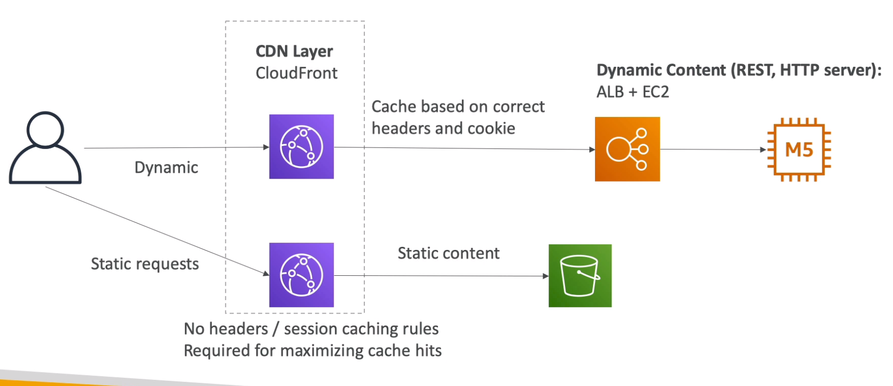
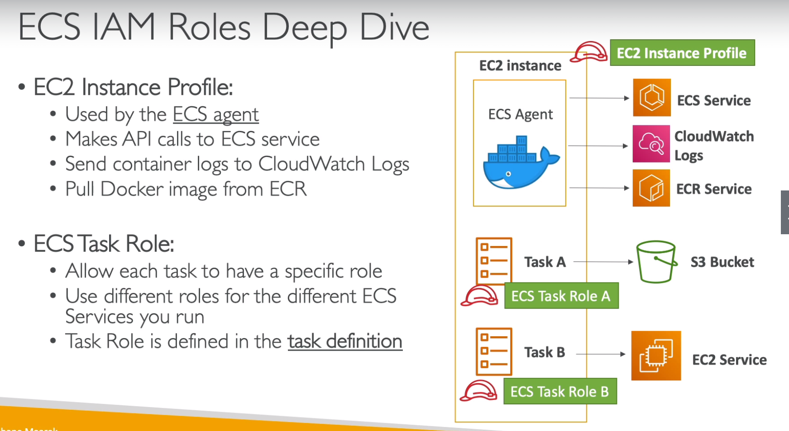
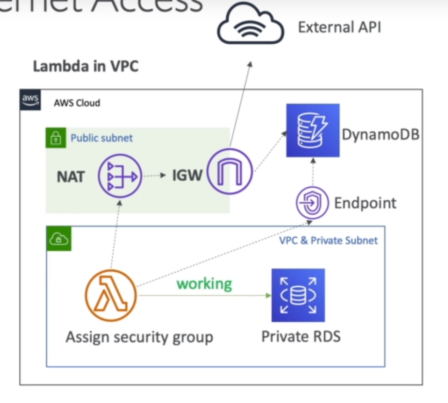
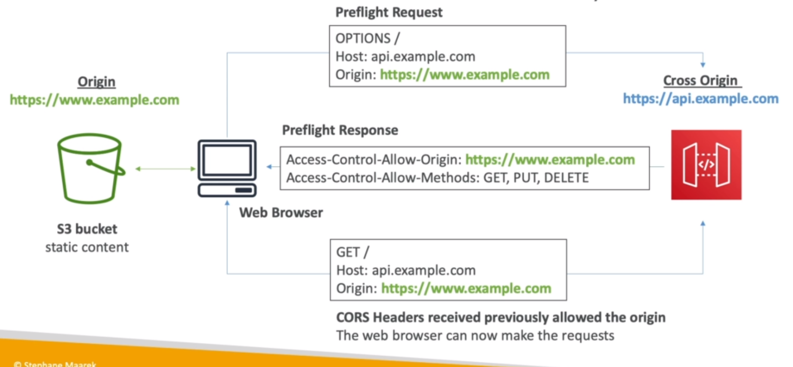

# AWS Certified Developer Associate - DVA-C01

- Download slides at: https://courses.datacumulus.com/downloads/certified-developer-k92/

## IAM + EC2

- Regions: Region is a cluster of data centers. For example: Us East (N. Virginia) us-east-1
- Availability zones: each region has many availabilty zones. One or more discrete data centers with redundant power, networdking and connectivity. They are seperate from each other, so they are isolated from disasters. They're connected with high bandwidth, ultra-low latency networking. For example: us-east-1a
- There are regional services like EC2 and global services like IAM
- IAM
    - IAM (Identity and Access Management) can set
        - Users: physical person
        - Groups: teams
        - Roles: internal usage within AWS resources
        - Policies
    - Root account is account used to create AWS account
    - Best to give users the minial amount of permissions they need to perform their job
    - IAM Federation: used by big enterprises so employees can login into AWS using their company credentials. Uses SAML standard (Active Directory)
    - Avoid using root account and make IAM account for adminstrator
    - Hands on
        - Create IAM User
            - Add user -> Add username -> Give programmatic access and AWS management Console access -> (attach essiting policies: administratorAccess) -> Create user
        - Use Group to assign permissions
            - manage groups -> create new group -> administratorAccess -> Create group
            - add users to group
            - click on particular user and detach AdminstratorAccess which is attached directly, since it is now part of the group and it is more manageable and is attached from group
- EC2
    - Consists of
        - Renting virtual machines (EC2)
        - Storing data on virtual drives (EBS)
        - Distributing load across machines (ELB)
        - Scaling the services using an auto-scaling group (ASG)
    - Security Groups: control how traffic is allowed into or out of our EC2 machines. Basically firewalls of EC2 instances
        - Inbound: traffic coming into
            - Port 22 allows ssh
        - Outbound: traffic going out
        - Authorized IP ranges: IPv4 and IPv6
        - Can be attached to multiple instances. Lives outside of EC3 instance
        - Locked down to a region / VPC combination
        - Its good to maintain one seperate security group for SSH access
        - If timeout then its security group issue
        - All inbound traffic is blocked by default, all outbound traffic is authorised by default
        - Able to authroize security groups as inbound traffic
    - Private vs Public IP (IPv4)
        - IPv4 is more common than IPv6(newer, IoT)
        - Public IP: machine can be identified on the internet. IP unique. Can be geolocated easily
        - Private IP: machince can be identified in the public network. IP must be unique across the private network. Machines connect to WWW using an internet gateway
        - Elastic IPs: when start and stop EC2 instance it changes its public IP. To have a fixed public IP an Elastic IP is needed
            - Avoid Elastic IP because
                - Often reflect poor architectural decisions
                - Instead, use a random public IP and register a DNS(route53) name to it
                - Or use a Load Balancer and dont use a public IP
    - EC2 User Date
        - bootstrap instances using an EC2 User data script. Launches commands when a machine starts only once
        - Automate boot tasks such as
            - Installing updates, installing software, downloading common files etc
        - EC2 User Data Script runs with the root user
    - EC2 Instance Launch Types
        - On Demand Instances: short workload, predictable pricing
            - Pay for what you use
            - Has highest cost but no upfront payment
            - No long term commitment
            - Recommended for short-term and un-interreupted workloads
        - Reserved: minimum 1 year
            - Reserved Instances: long workloads
                - upto 75% discount compared to On-demand, pay upfront, recommended for steady state usage applications (think database)
            - Covertible Reserved Instances: long workloads with flexible instances
                - can change the EC2 isntance type
            - Scheduled Reserved Instances: example - every Thursday between 3 and 6 pm
                - launch within time window you reserve. When you require fraction of a day / week / month
        - Spot Instances: short workloads, for cheap, can lose instances (less reliable)
            - 90% discount compared to on demand
            - Instances that you can "lose" at any point of time if your max price is less than the current spot price
            - The most cost-efficient on AWS
            - Useful for workloads that are resilient to failure. Anything that is possible to retry like batch jobs, data analysis. Bad for critical jobs or databases
            - Great combo: Reserved instances for baseline + On-Demand & Spot for peaks
        - Dedicated Instances: no other customers will share your hardware
        - Dedicated Hosts: book an entire physical server, control instance placement
            - Full control of EC2 instance placement, allocated for your account for a 3 year period reservation, more expensive. Useful for software that have complicated licensing model. Or for companies that have strong regulatory or compliance needs
    - Elastic network Interfaces (ENI)
        - logical component in a VPC that represents a virtual network card
        - ENI can have
            - Primary private IPv4, one or more secondary IPv4
            - One Elastic IP (IPv4) per private IPv4
            - One pulbic IPv4
            - One or more security groups
            - A MAC address
        - Bound to specific availability zone
        - Can create ENI independently and attach them on the fly (move them) on EC2 instances for failover
    - Custom AMI can be created for faster boot time(no need for long ec2 user data at boot time), pre-install packages needed, etc. AMI are built for a specific AWS region
    - M instance are instance types that are mixed
    - T2/T3 instance types are "burstable"
        - Burst means that overall, the instance has OK CPU performance
        - Whtn the machine needs to process something unexpected it can burstm abd COU can be very good
        - It the machine bursts, it utilizes "burst credits". If all the credits are gone, the CPU becomes BAD.
        - If the machine stops bursting, credits are accumulated over time
    - Hands on
        - Remeber to set region
        - Launch instance
            - Click launch instance -> Set Amazon Machine Image (AMI) select Amazon Linux 2 AMI -> step 3: network : defulat vpc, subnet says in which availability zone we want our instance to be -> Step 4: storage (EBS): defines where OS will be -> Step 5: Add tags: set Name -> Step 6: Configure Security group: create a new security group 0.0.0.0/0 (means any IP) -> Launch -> Key pair allows to ssh so create a new key pair and download key pair
        - SSH
            - (Only windows, for linux based use chmod) Right click on PEM file -> security -> Make yourself owner -> Remove all other user except yourself
            - Click on ec2 instance -> connect
        - Set Elastic IP
            - EC2 console -> In menu under network and security click Elastic IP -> Allocate Elastic IP address -> Allocate -> Actions -> Associate Elastic IP Address -> Choose instance -> Associate
            - Need to release elastic IP address from actions if it is not in use and linked to an instance
        - Install Apache on EC2
            ```sh
            #!/bin/bash
            sudo su
            yum update -y
            yum install -y httpd.x86_64
            systemctl start httpd.service
            systemctl enable httpd.service
            ```
            - Go to security rules to allow inbound port 80. Http, tcp, 80, 0.0.0.0/0
            - Go to public IP address on browser {public_ip}:80
            - `echo "Hello World from $(hostname -f)" > /var/www/html/index.html`
        - EC2 User Data
            - Launch new instance -> Step 3: Configuring Intsance Details: Advanced Details: As text: add install apache script
        - ENI
            - Create 2 instances in the same availability zone -> once created network interfaces says eth0, hover over it and go to interface id
            - Menu in EC2 console -> Under network and security menu (network interfaces) -> create network interface -> make sure its in the same subnet -> Attach security group -> right click on it and attach it to one of the instance. Now that instance has to private IP
    
## ELB + ASG

- Scalability means that an application / system can handle greater loads by adapting
- Types of scalability
    - Vertical: increasing size of the instance. Common for database. Ex: t2.micro -> t2.large
    - Horizontal: increasing number of instances / systems for your application. Common for web applications. Ex: 1 t2.micro -> 4 t2.micro
- High Availability: goes hand in hand with horizontal scaling. High availability means running application in at least 2 data centers. Goal is to survive a data center loss
- Elastic Load Balancer (ELB)
    - Load balancers are servers that forward internet traffic to multiple servers (EC2 instances)
    - Why use load balancers
        - Expose singple point of access (DNS) to application
        - Seamlessly handle failures of downstream instances
        - Provide ssl termination for your websites
        - Enforce stickiness with cookies
        - High availability across zones
        - Seperate public traffic from private traffic
    - ELB is a managed load balancer. This means AWS will take care a lot of things
    - Health checks are crucial for load balancers. They enable the load balancer to know if instances it forwards traffic to are available to requests. The health check is done on a port and a route(/health is common). If response is not 200 then the instance is unhealthy
    - Type of load balancer on AWS. Application Load Balancer or Network Load Balancer is preferred
        - Classic Load Balancer (2009): HTTP, HTTPS, TCP
        - Application Load Balancer (2016): HTTP, HTTPS, WebSocket
            - Load balancing to multiple HTTP applications across machines
            - Load blancing to multiple applications on the same machine (ex: containers)
            - Redirect HTTP to HTTPS
            - Routing tables to different target groups
                - Routing based on path in URL
                - Routing based on hostname in url
                - Routing based on query string, headers
            - ALB are a great fit for micro services & container-based application
            - Application servers don't see the IP of the client directly
                - The true IP of the client is inserted in the header X-Forwarded-For
        - Network Load Balancer (2017): TCP, TLS (secure TCP) & UDP
            - handle millions of request per seconds
            - Less latency ~100 ms (vs 400 ms for ALB)
            - NLB has one static IP per AZ, and supports assigning Elastic IP
            - NLB are used for extreme performance, TCP or UDP traffic
    - NLB expose a public static IP, whereas ALB or CLB exposes a static DNS (URL)
    - Can set internal or external ELBs
    - Load balancer stickiness: same client is always redirected to the same instance behind a load balancer
        - Only works for CLB and ALB
        - The "cookie" used for stickiness has an expiration date you control
        - Make sure the user doesnt lose his session data
        - Enabling stickiness may bring imbalance to the load over the backend EC2 instances
    - Cross-Zone Load Balancing: each load blancer instance distributes evenly across all registered instances in all AZ
        - Otherwise distributes requests evenly across the registered instances in its AZ only
        - CLB: disabled by default, no charges for inter AZ data if enabled
        - ALB: always on, no charges for inter AZ data
        - NLB: disabled by default, pay charges for inter AZ data if enabled
    - ELB: SSL Certificates
        - SSL certificate allows traffic between your clients and your load balancer to be encrypted in transit (in-flight encryption)
        - TLS refers to transport Layer Security, which is newer version of SSL. TLS certificates is mainly used, people still refer to it as SSL
        - Can manage sertificates using ACM (AWS Certificate Manager)
        - SNI (Server Name Indication): solves loading multiple SSL certificates onto one web server (to server multiple websites). Only works for ALB, NLB, CloudFront
    - ELB: Connection Draining
        - Connection draining is the time to complete "in flight requests" while the instance is de-registering or unhealthy. ELB stops sending new requests to the instance which is de-registering
        - CLB: Connection Draining
        - Target Group: Deregistration Delay for ALB & NLB
    - Hands On
        - ELB security groups
            - inbound load balancer[Http, tcp, 80, 0.0.0.0/0], [Https, tcp, 443, 0.0.0.0/0]
            - inbound ec2 [http, tcp, 80, security group id] 
        - Classic Load Balancer (CLB)
            - EC2 console -> Menu (load balancing: Load balancers) -> create load balancer (CLB) -> Give name and VPC -> Assign security group [custom tcp, tcp, 80, 0.0.0.0/0] -> Go to DNS name
            - Can still go to website without Load balancer to fix: Security group for inbound ec2 instance -> change to [http, tcp, 80, security group id]
            - Add another instances to load balancer: Go to oad balancers in menu -> Instances -> edit instances
        - Application Load Balancer (ALB)
            - EC2 console -> Menu (load balancing: Load balancers) -> create load balancer (ALB) -> Give name and scheme is internet facing, select VPC and AZ -> Assign security group [custom tcp, tcp, 80, 0.0.0.0/0] -> Step 5: Register targets: select instances
            - Can still go to website without Load balancer to fix: Security group for inbound ec2 instance -> change to [http, tcp, 80, security group id]
            - If 503 error then something wrong with target group. Go to target groups in menu -> targets -> edit -> add instances -> add to registered -> save
            - In order to set rules go to listeners for load balancers -> view/edit rules -> Edit and then can insert rule based on header, path, query string. This can also be used to route to multiple target groups
        - Network Load Balancer (NLB)
            - EC2 console -> Menu (load balancing: Load balancers) -> create load balancer (NLB) -> Give name and scheme, set AZ -> Step 3: Set target group as instance -> Step 4: Addd to registered the instances -> Create
            - For NLB instances see that traffic is coming from outside not the load balancer: go to target group attached to it, all the targets are unhealthy -> go to one of the instance and to the security group -> add rule [Custom TCP, TCP, 80, 0.0.0.0/0] -> wait health checks to pass
        - Load balancer stickiness (ALB)
            - Go to target group for load balancer -> Edit attributes -> Stickiness enabled -> Set duration -> Save
        - CLB SSL
            - Go to load balancer -> listeners -> and do all operations there
- Auto Scaling Group (ASG)
    - Scale in/out to match an increased/decreased load
    - Automatically register new instances to a load balancer
    - ASG has:
        - Launch configuration
            - AMI + Instance Type, EC2 user date, EBS volumes, securtiy groups, SSH key pair
        - Min size . max size / initial capacity
        - network + subnets Information
        - Load balancer information
        - Scaling Policies
    - Auto scaling alarms
        - Possible to scale ASG based on CloudWatch alarms
        - Metrics are computed for the overall ASG instances
    - To update an ASG, must provide a new launch configuration / launch template (newer)
    - Having instances under ASG measn that if they are terminated the ASG will automatically create new ones as a replacement
        - EC2 can be terminated if marked unhealthy by load balancer
    - Auto scaling groups - scaling policies
        - Types
            - Target tracking scaling
                - Easiest to set up
                - Example: want the average AASG CPU to stay at around 40%
            - Simple / Step Scaling
                - When a CloudWatch alarm is triggered then perform action
            - Scheduled Actions
                - Anticipate a scaling based on known usage patterns
        - Cooldown period helps to ensure that your ASG doesnt launch or terminate additional instances before the previous scaling activity takes effect
            - Scaling specific cooldown period overrides the default cooldown period
            - If application is scaling up and down multiple times each hour, modify the ASG cool-down timers and the CloudWatch Alarm Period that triggers the scale in
    - Hands on
        - Set up Autoscaling
            - EC2 console -> left menu auto scaling groups -> create autoscaling group -> enter name and create launch template -> add name, version, select ami, select instance type, select key-pair, select security group, in advanced details add user data -> create launch template
            - In ASG console select the template created in the previous step -> next -> select subnets -> next -> enable load balancing, select target group -> next -> set group size -> next, next, next, create auto scaling group
        - Scaling policies
            - EC2 dashboard -> auto scaling groups -> select group -> automatic scaling -> scaling policies (add) -> select policy and other fields. The rules can be seen in cloudwatch

## EBS + EFS

- EBS (Elastic Block Store)
    - is a network drive you can attach to your instance while they run
    - If EC2 machine terminated then loses root volume. EBS allows you to store your instance data somewhere. EBS allows to persist data
    - Uses network to communicate with the instance, which means there is some latency
    - It can be fetached from an EC2 instance and attached to another one quickly
    - It is locked to an AZ. To move across, you need to first need to snapshot it
    - Charged for amount of gigabytes provisioned
    - Types
        - GP2 (SSD): general purpose ssd
            - Recommended for most workloads
            - Least expensive for ssd
        - IO1 (SSD): highest performance ssd, low latency or high throughput
            - critical business applications
            - >16000 IOPS(Input/Output operations per second) per volume
            - Critical database
        - STI (HDD): low cost designed for frequently accessed, throughput-intensive workloads
            - Streaming workloads requiring consistent, fast throughput at low price
            - Big data
        - SC1 (HDD): lowest cost designed for les frequently accessed workloads
            - Storage of data that is infrequently accessed
    - Only GP2 and IOI can be used as boot volumes
    - EBS vs Instance store
        - Instance store = ephemeral storage. Instance store is physically attached to the machine. EBS is a network drive
        - Pros for instance store:
            - Better I/O performance
            - Good for cache
            - Data survives reboots
        - Cons for instance store:
            - On stop or termination, the instance store is lost
            - Can't resize instance store on fly
            - Backups must be operated by the user
    - Hands on
        - Create EBS
            - EC2 console -> launch instance -> Step 4: Add storage EBS can be set up here
            - Left side menu (elastic Block Store: Volumes)
            - `lsblk` on terminal lets to see EBS attached. EBS can be mounted on different folders
        - Create Instance store
            - EC2 console -> launch instance -> step 2: choose an instance type -> in the instance type column look for something that has instance store
- EFS (Elastic File System)
    - Managed NFS (network file system) that can be mounted on many EC2, and unlike EBS can be mounted on multiple-AZ
    - Highly available, scalable. Pay per use. So if less data this might be cheaper than EBS
    - EBS linked to one EC2 instance while EFS can be shared at the same time
    - Use cases: content management, web serving, data sharing
    - Compatible with Linux based AMI
    - Encryption at rest using KMS
    - Performance and Storage classes
        - EFS scale: thousands of concurrent NFS client
        - Performance
            - General purpose: latency-sensitive use cases
            - Max I/O: higher latency, throughput, highly parallel
        - Storage (lifecycle management feature - move file after N days)
            - Standard: for frequently accessed files
            - Infrequent access (EFS-IA): files less accessed, lower price to store but higher price for retrieval
    - Hand-on
        - Create EFS
            - EFS console -> create file system -> customize to look into things or else click create (security group: inbound NFS and security group of ec2 instance) -> create ec2 instance that accesses file system (can be done in step 3), different security group for ec2
        - EC2 to file system manually
            - EFS console -> attach -> Mount by DNS -> EFS mount helper -> go to user guide and install amazon utils package
- EBS vs EFS
    - EBS: only one instance at a time and locked in at AZ level. Migrating means taking a snapshot and restore snapshot into another AZ. EBS volume terminated if EC2 terminated
    - EFS: mounted across different instances across different AZs. Only for linux. Can share files. Generally more expensive than EBS. Can use EFS-IA for cost savings
    - Instance store physically attached to EC2 and therefore very fast IO. Something like database

## RDS + Aurora + ElastiCache

- RDS (Relational Database Service)
    - Managed DB service, use SQL. Supported: Postgres, MySQL, MariaDB, Oracle, Microsoft SQL Server, Aurora
    - Since it is managed we chose it over running it over EC2
        - Automatic provisioning
        - Continuous backups
            - Automated. Done daily. Transaction logs backed up every 5 min. Therefore can restore to any point in tome (from older to 5 min ago). 7 day retention but can be increased to 35 days
            - DB snapshots are also available and manually triggered by the user. Retention of backup as long as you want
        - Monitoring dashboard
        - Multi AZ setup for DR (disaster Recovery)
        - Storage backed by EBS
        - But we cannot SSH into RDS
    - Read replica help scale read. Can create upto 5 read replica, (within az, cross az or cross region), replication is async so reads are eventually consistent, replicas can be promoted to their own DB
        - Network cost: when data goes from AZ to another. Cost can be mitigated is read replica in the same AZ, network cost is free
        - Multi az (disaster recovery)
            - sync replication happens instantly. Application talks to one dns name. If failover in master then talks to other database (standby database). Increase availability. Not used for scaling. Standby database is for standby and for failover. Read replicas can be set up as multi az
    - RDS security - Encryption
        - At rest encryption (data not in movement): possibility to encrypt the master & read replicas with AWS KMS - AES-256 encryption
            - Has to be defined at launch time
            - If master not encrypted, the read replicas cannot be encrypted
            - Trasparent Data Encryption (TDE) available for Oracle and SQL server
        - in Flight encryption (SSL certificates): to encrypt data to RDS in flight
            - Enfore SSL
                - PostgreSQSL: rds.force_ssl=1 in the AWS RDS console
                - MySQL: GRANT USAGE ON *.* TO 'mysqluser\@%' REQUIRE SSL;
    - RDS Encruption Operations
        - Encrypting RDS backups
            - snapshots of un-encrypted RDS database are unencrypted
            - snapshots of encrypted RDSD databases are encrypted
            - Can copy a snapshot into an encrypted one
        - To encrypt an unencrypted RDS database
            - create a snapshot of the unencrypted database
            - Copy the snapshot and enable encryption for the snapshot
            - Restore the database fro the encrypted snapshot
            - Migrate applications to the new database, and delete the old database
    - RDS Security - Network and IAM
        - Network Security
            - RDS databases are usually deployed within a private subnet, not a public one
            - RDS security works by leveraging security groups (same as EC2) - it controls which IP / security group can communicate with RDS
        - Access Management
            - IAM policies help control who can manage AWS RDS
            - Traditional Username and Password can be used to login the database
            - IAM based authentication can be used for MySQL and Postgres
    - Hand on
        - Create database
            - rds console -> databases tab -> create database
            - Instancs tab has connect endpoint
- Aurora
    - AWS proprietary. Compatible with Postgres and MySQL. Cloud optimized
    - Aurora storage automatically grows
    - 20% for costly but very efficient
    - 6 copies of data across 3 AZ
    - Can have 15 read replicas and any of them can become master if it failes. Automated failover for master is less than 30 seconds
    - Has a thing called self healing
    - Aurora DB Cluster
        - Writer endpoint: pointing to the master
        - Reader endpoint: connecting to load balancing. Which is connected to read replicas that auto expands
        - Shared storage volume that auto expands
    - Security
        - Similar to RDS
        - Encryption at rest using KMS, automated backups and snapshots, encryption with SSL, possiblity to authenticate usin IAM
    - Serverless
        - Automated database instantiation and auto-scaling based on actual usage 
        - Good for infrequent, intermittent or unpredictable workloads
        - No capacity planning needed
        - Pay per second can be more cost-effective
    - Global
        - Aurora cross region read replicas: useful for disaster recovery
        - Global Database: 1 primary region (read/write), upto 5 seconds (read-only) regions, replication lag is lass than 1 second
        - Promoting another region has an RTO of <1 minute
    - Hands on
        - Create Database
            - RDS console
- ElastiCache
    - Overview
        - ElastiCache is to get managed Redis or Memcached
        - In-memory databases with really high performance, low latency
        - Help reduce load off of databases for read intensive workloads
        - Helps make application stateless
        - Write scaling using sharding
        - Read scaling using Read Replicas
        - Multi AZ with Failover Capability
    - ElastiCache can be used to do user session store
        - application writes the session data into ElastiCache
        - The user hits another instance of our application
        - The instance retrieves the data and the user is already logged in
    - Redis vs memcached
        - Redis (like RDS): Multi AZ with Auto-Failover, read replicas to scale reads and have high availability, data durability using AOF persistence, backup and restore features
        - Memcached: Multi-node for partitioning of data (sharding), non-persistent (if node goes down, data is lost), no backup and restore, multi-threaded architecture
    - Caching Implementation Considerations
        - Design Pattern
            - Lazy Loading / Cache-Asige / Lazy Population
                - application asks cache
                - if hit fetch from cache
                - if miss then fetch from RDS and then write to cache
                - Pros: only requested data cached, node failures are not fatal (increased latency to warm the cache)
                - Cons: for cache miss 3 round trips, stale data might exist in the cache
            - Write through
                - application asks cache
                - if hit fetch from cache
                - on write to database, a write to cache is also made
                - Pros: data in cahce is never stale, write penalty vs read penalty (each write requires 2 calls)
                - Cons: missing data until RDS is updated. Cache churn - a lot of the data will never be read
        - Cache eviction
            - Caches can be deleted explicitly
            - item is evicted because the meory is full and its not receuntly used (LRU)
            - you set an item time-to-live (or TTL)
    - Hands on
        - Create Elasticache
            - elasticache console -> Get starded now -> create

## Route 53

- Route53 is managed DNS
- DNS is collection of rules and records which helps clients understand how to reach a server through its domain name
- Most common records
    - A: hostname to IPv4
    - AAAA: hostname to IPv6
    - CNAME: hostname to hostname
    - Alias: hostname to AWS resource
- Route53 can use public and private domains
- Route53 features
    - Load balancing
    - Health checks
    - Routing policy: simple, failover, geolocation, latency, weighted, multi value
- TTL (Time to Live)
    - web browsers and client to cahce DNS query. This is so queries are not made to route 53 to get the A record. The IP will be stored in the browser till TTL expires
        - High TTL: about 24 hours. Less traffic on DNS. Posibly outdated records
        - Low TTL: about 60 s. More traffic on DNS. Records are outdated for less time. Easy to change records
    - TTL is mandatory for eac DNS record
- ELB is used to load balance in a single region. Route 53 intended to help balance traffic across regions
- CNAME vs Alias
    - CNAME: hostname -> hostname
        - Only for non root domain (ex: something.mydomain.com)
    - Alias (type A record): hostname -> AWS resource
        - Works for root and non root domain
        - Free of charge
        - Native health check
- Routing Policies
    - Simple Routing
        - Web browser asks for domain and Route 53 returns A record
        - Use when you need to redirect to a single source
        - Can't attach health checks to simple routing policy
        - If multiple values are returned, a random one is chosen by client. This can be used to do clientside loadbalancing
    - Weighted Routing
        - Control the % of the requests that go to specific endpoint
        - Helpful to test a certain percent of traffic on a new app version
        - Helpful to split traffic between two regions
        - Can be associated with health checks
    - Latency Routing
        - Most often the most suitable routing policy
        - Redirect to the server that has the least latency close to us
        - Latency is evaluated in terms of user to designated AWS region
    - Health Check
        - deemed unhealthy if fails 3 checks in a row
        - default health check interval 30s
        - integrate these health check with cloudwatch
    - Failover Routing Policy
        - There is route53 and two ec2 instances: primary, secondary(disaster recovery)
        - Health check for primary and if it fails then failover to secondary
    - Geolocation Routing
        - Routing based on user location
        - Need to create a default policy in case there's no match on location
    - Multi value routing policy
        - use when routing traffic to multiple resources
        - want to associate a route 53 health checks with records
        - basically simple routing with health checks
        - up to 8 healthy records returned for each multi value query
        - multi value is not a substitue for having an elb
- Hands on
    - Create route53
        - Route53 console -> register domain -> create A record to point DNS to ip
            - To check ip from terminal `dig {website}`
    - TTL Record
        - Route 53 -> create record set has option for TTL
    - Simple routing
        - Multiple IP values can be placed and the browser will pick one
    - Weighted Routing
        - Enter IP in value, set routing policy as weighted, set weight, and set a name in ID, need to create multiple
    - Latency Routing
        - Routing policy latency, set region and set instance, need to create multiple
    - Health check
        - Route 53 health check -> create health check
    - Failover routing
        - Hosted zone -> create record set -> then set routing policy
    - Geolocation routing
        - In hosting zone create record -> routing policy geolocation

## Virtual Private Cloud (VPC)

- **VPC**: private network to deploy your resources (regional). Set of IP range called CIDR range
- **Subnets**: allow you to partition your network inside your VPC (AZ resource)
    - **Public subnet**: is a subnet that is accessible from the internet
    - **Private subnet**: is a subnet that is not accessible from the internet
- **Route table**: define access to the internet and between subnets
- **Internet Gateways (IGW)**: helps VPC instances connect with the internet
    - Public subnets have a route to the internet gateway
- **NAT Gateway (managed) & NAT instances (self-managed)**: allow instances in your private subnets to access the internet while remaining private
    - Deploy NAT to public subnet. Private subnet connects to NAT and NAT coonnects to Internet Gateway
- **NACL (Network ACL)**: a firewall which controls traffic from and to subnet
    - Can have ALLOW and DDENY rules
    - Are attached at the Subnet level
    - Rules only include IP addresses
    - First mechanism of defense of public subnet
- **Security Groups**: firewall that controls traffic to and from an EC2 instance
    - Can have only ALLOW rules
    - Rules include IP addresses and other security groups
    - Operates at instance level
- Traffic goes from web -> nacl -> security group -> EC2 instance
- **VPC Flow logs**: capture information about IP traffic going into your interfaces
    - Helps to monitor & troubleshoot connectivity issues
- **VPC Peering**: connect two VPC, private using AWS's network
    - Make them behave as if they were in the same network
    - Must not have overlapping CIDR (IP address range)
    - VPC Peering connection is not transitive (must be established for each VPC that need to communicate with one another)
- **VPC Endpoints**: Endpoints allow you to connect to AWS Services using a private network instad of the public www network
    - This gives you enhanced security and lower latency to access AWS services
- Site to Site VPN: connect an on-premises VPM to AWS
    - the connections is automatically encrypted
    - Goes over internet
- Direct Connect (DX)
    - Establish a physical connection between on-premises and AWS
    - The connection is private, secure and fast
    - Goes over a private network
- Typical 3 tier solution architecture
    - 

## Amazon S3 Intro

- S3: infinitely scaling storage
    - allows to stores objects(files) in buckets (directories)
    - buckets defined at regional level even though s3 is global
    - naming convention: no uppercase, no underscore, must start with lowercase letter or number
- Object values are the content of the body:
    - max object size is 5 TB
    - if uploading more that 5 GB, must use "multi part upload"
- Versioning
    - Needs to be enabled in bucket level
    - Same key overwrite will increment the version: 1, 2, 3...
    - Best oractice to version your buckets
        - Protect unintended deletes
        - Easy roll back to previous version
    - Any file not versioned prior will have null
    - Deleting puts a delete marker
    - Deleting the marker and one of the files under will permanently delete
- Encryption
    - 4 methods to encrypt objects
        - **SSE-S3**: encrypts S3 objects using keys handled and managed by AWS
            - Object is encrypted server side
            - AES-256 encryption
            - must set certain header "x-amz-server-side-encryption":"AES256"
            - data key is managed by AWS S3
        - **SSE-KMS**: leverage AWS Key Management Service to manage encryption keys
            - data key is managed by KMS
                - Advantages: user control + audit trail
            - Object is encrypted server side
            - must set certain header "x-amz-server-side-encryption":"aws:kms"
        - **SSE-C**: when you want to manage your own encryption keys
            - data key is provided by customer outside of AWS. It is not stored in aws
            - HTTPS must be used
            - encryption key must be provided in HTTP headers, for every HTTP request made because it will be discarded
            - the same key need to be provided to get back the data
        - **Client side encryption**
            - encrypt object before uploading to S3. Library such as Amazon S3 Encryption client
            - decryption is also done on client
            - customer manages key and encryption cycle
- Security
    - User based
        - IAM policies - which API calls are allowed
    - Resources based
        - Bucket policies - bucket wide rules from the S3 console - allows crosst account
            - JSON based policies
                - Resources: buckets and objects
                - Actions: set of API to Allow or Deny
                - Effect: Allow/Deny
                - Principal: The account or user to apply the policy to
        - Object Access Control List (ACL) - finer grain
        - Bucket Access Control List (ACL) - less common
        - Block Public Access
            - block public access to buckets and objects granted through new ACLs, any ACLs, new public bucket or access point policies
            - created to prevent company data leaks
            - if you know bucket should never be public, leave these on
            - can be set at the account level
        - Networking
            - Support VPC endpoint (for instances in VPC without www internet)
        - Logging and Audit:
            - S3 Access Logs can be stored in other S3 bucket
            - API calls can be logged in AWS CloudTrail
        - User Security
            - MFA(multi factor authentication) delete
            - Pre-Signed URLs: urls that are valid only for a limited time
- S3 Website
    - set static website hosting as enabled
- Cors (cross-Origin Resource Sharing)
    - web browser has security built in that it does not allow requests to other origins while visiting the main origin unless it has the appropriate header
- S3 is eventually consistent
    - Might get older version of object if doing get quickly after put/delete
    - No way to request strong consistency
- Hands On
    - Create S3
        - go to s3 -> create bucket (needs to be globally unique in aws) -> choose region even though console is global (s3 is not global, its regional)
        - object actions -> open to see file. This is a private url. This is a presigned url which aws uses to verify credentials
        - object url can be used to view file by pasting the url in the browser. This is public url, so if s3 is not public then it wont be visible
    - Version
        - Go to properties -> Bucket versioning -> enabled
    - Encryption
        - click on file -> server-side-encryption setting -> shows encryption settings
        - when uploading files -> advanced settings has encryption option -> set encryption there
        - bucket can have default encryption options -> go to properties in bucket and scroll to encryption settings
    - S3 bucket policies
        - permissions -> bucket policy -> policy generator -> remember to add /* at end of ARN to apply to all objects
    - S3 website
        - upload files -> properties -> static website hosting to enabled
        - permissions -> dont block public access -> write bucket policy that allows public access
    - S3 Cors
        - if contents in different buckets -> permissions -> CORS settings

## AWS CLI, SDK, IAM Roles & Policies

- need to install aws cli
- configure cli
    - get access credentials from IAM -> users -> security credentials -> create access key
    - `aws configure` -> paste id and key
- aws cli on ec2
    - use aws iam roles
        - can be attached to ec2 instances
        - can come with a policy authorizing exactly what the ec2 instance should be able to do
    - ec2 -> ssh into public ip -> `aws configure` and do not put id and key -> go to iam, create role, attach to aws service, get a managed policy -> right click on ec2 instance and attach iam role
- inline policy is added on top off what is chosen. Not possible to be added to other roles. NOT RECOMMENDED. Globabl policies are better for management
- google `aws policy simulator` to test policies
- some aws cli commands (not all) contain a `--dry-run` option to simulate API calls
- to decode what the error message means when running commands from the cli use: `sts decode-authorization-message`
- ec2 instance metadata
    - allows ec2 instances to learn about themselves without using an IAM Role for that purpose
    - `http://169.254.169.254/latest/meta-data/`: use in ec2 instance to get IAM role name
- cli profile
    - create profile: `aws configure --profile [profile-name]`
    - function against profile: `aws s3 ls --profile [profile-name]`
- MFA with cli
    - `aws sts get-session-token`: pass in mfa token from device
- aws sdk: sdk we use to perform actions on AWS directly from applications code
    - if region not specified, then us-east-1 is selected by default
- AWS limits
    - api rate limits
    - service quotas: how many resources of something we can run
- Exponential Backoff is a throttling mechanism. API call duration is doubled everytime it fails
- AWS credentials provider chain. CLI looks for credentials in order: command line options -> environment variables -> cli credentials files -> cli configuration file -> container credentials -> instance profile credentials
- Never store credentials in code. Use IAM roles. If working outside of AWS then use env variables / named profiles.
- SigV4 is signing requests when sending to aws. All api requests need to be signed
- AWS Cli depends on python

## Advanced S3 & Athena

- MFA Delete
    - Need to enable versioning. Need MFA to delete an object version or suspend versioning on the bucket
    - can only be done through cli
- S3 Access Logs
    - any request made to s3 from any account, authorized or denied, can be logged
    - analysis on this data can be done through Amazon Athena
    - Do not set your logging bucket to be the monitored bucket as it will create a logging loop and bucket will grow in size exponentially. Seperate application and logging bucket
- S3 Replication: replicate bucket from one region to another regiion. Must enable versioning in source and destination. Copying is asynchronous. Must give proper IAM permissions to S3. After activating only new objects are replicated. Deletes not replicated
    - CRR(Cross region replication). Use cases: compliance, lower latency access, replication across accounts
    - SRR(Same region replication). Use cases: log aggregation, live replication between production and test accounts
- S3 Presigned url
    - can generate it using sdk or cli
        - downloads is easy and can be done using cli
        - uploads is harder and must use sdk
    - presigned url valid for 3600 default and can be changed by passing parameters
- S3 Storage classes
    - Amazon S3 standard: general purpose
        - high durability, availability, can sustain 2 concurrent facility failures
        - use cases: big data analytics, mobile & gaming applications, content distribution
    - Amazon S3 Standard-infrequent Access (IA): when files infrequently accessed
        - suitable for data that is less frequently accessed, but requires rapid access when needed
        - low cost compared to S3 standard
        - use cases: data store for disaster recovery, backups
    - Amazon s3 One zone-infrequent access: when we can recreate the data
        - data is stored in a single AZ
        - high durability, but if AZ is destroyed then data lost
        - low latency and high throughput
        - SSL for data at transit and encryption at rest
        - low cost compared to IA (by 20%)
        - use cases: storing secondary backup copies of on premise data, or storing data you can recreate
    - Amazon S3 intelligent tiering: move data between storage classes intelligently
        - low latency and high throughput performance of S3 standard
        - small monthly monitoring and auto-tiering fee
    - Amazon Glacier: archieves
        - low cost object storage meant for archiving/backup
        - data is retained for the longer term (10s of years)
        - very cheap
        - archieves are stored in vaults not buckets
        - types of glacier
            - glacier. Minimum storage duration 90 days
                - Expedited (1 to 5 minutes retrieval)
                - Standard (3 to 5 hours retrieval)
                - Bulk (5 to 12 hours retrieval)
            - Amazon Glacier Deep Archieve: archieves not needed right away. Much cheaper. Minimum storage 180 days
                - standard (12 hours retrieval)
                - bulk (48 hours retrieval)
- S3 Lifecycle rules
    - you can transition objects between storage classes
    - moving objects can be automated using a lifecycle configuration
    - transition actions: defines when objects are transitioned to another storage class
    - expiration actions: configure objects to expire (delete) after sometime
        - can be used to delete old versions of files (if versioning enabled)
        - can be used to delete incomplete multi-part uploads
- S3 Baseline Performance
    - scales to high requests rates and low latency
    - if you use SSE-KMS, you may be impacted by the KMS limits (KMS quota per second varies by region)
        - when you upload it called the generateDataKey KMS API
        - when you download it called the decrypt kms api
    - optimize
        - multipart upload: recommended for files > 100 MB, must for files > 5 GM. Can help parallelize uploads (speed up transfer)
            - ie file is split into multiple parts and all uploaded simultaneously. AWS is smart enough to combine all these files once they are uploaded
        - S3 transfer acceleration (upload only): increase transfer speed by transferring file to an AWS edge location which will forward the data to the S3 bucket in the target region
            - ie file from usa -> edge location -> s3 bucket in australia (fast private aws network is used to send data here)
        - S3 Byte range fetches: parallelize GETs by requesting specific byte ranges. Better resilience in case of failures
            - can get partial amount of file
            - speed up downloads
- S3 select & glacier select
    - sql queries can be performed on s3 to filter by rows and columns. Less network transfer, less CPU cost client-side. Filtering is done server side
- S3 Event notifications: once there is an S3 event like file upload or delete certain tools can be triggered. Versioning must be enabled for this
    - SNS: send notification by emails
    - SQS: simple queue service
    - lambda function
- AWS Athena
    - Serverless service to perform analytics directly against S3 files
    - uses sql language to query the files
    - charged per query and amount of data scanned
    - supports csv, json, orc, avro and parquet
    - Use cases: Business intelligence/ analytics, VPC Flow Logs, ELB Logs, Cloudtrail trails
    - Anytime data needs to analyzed on S3 use Athena
- S3 Object lock & glacier vault lock
    - S3 object lock
        - Adopt WORM (Write Once Read Many) model. Block an object version deletion for a specified amount of time
    - Glacier Valut Lock
        - Adopt WORM (Write Once Read Many) model. Lock the policy for future edits (can no longer be changed) for a specified amount of time
        - Helpful for compliance and data retention
- Hands On
    - S3 Access Logging
        - properties of bucket -> server access logging to enabled and then select target bucket. This bucket now gets write access to the other bucket. Remember to make seperate application and logging bucket
    - S3 Replication
        - enable bucket versioning in source and target bucket -> management in bucket -> replication rules. Files before replication rules set will not be replicated. Only newer objects will be
    - Presigned url
        - `aws s3 presign s3://mybucket/myobject --expires-in 300 --region my-region`
    - Storage classes
        - additional upload options when uploading a file. Storage classes of objects can be changed later as well
    - Lifecycle role
        - management -> lifecycle role
    - S3 bucket notification
        - properties -> event notifications
    - Athena
        - set query results location in athena
        - look up `how do i analyze my amazon s3 server access logs using athena` to learn how to do queries

## AWS Cloudfront

- Cloudfront is a CDN
    - improves read performance as content is cached at the edge
    - It gives DDos protection, integration with Shield, AWS Web Application Firewall
    - Can expose external HTTPS and can talk to internal HTTPS backends
    - request from cdn to resource is done over private network
- CloudFront Origins (put cloudfront in front of)
    - S3 Bucket
        - For distributing files and caching them at the edge
        - Enhanced security with CloudFront Origin Access Identity (OAI)
        - CloudFront can be used as an ingress (to upload files to S3)
    - Custom Origin (HTTP)
        - Application Load Balancer
        - EC2 instance
        - S3 Website
        - Any HTTP backend
- Cloudfront has Geo Restriction. We can have whitelist and blacklist for countries
    - Use case: Copyright Laws
- Cloudfront vs S3 Cross Region Replication
    - Cloudfront
        - Global Edge Network
        - Files are cached for a TTL (maybe a day)
        - Great for static content that must be available everywhere. We are okay if content outdated a little bit
    - S3 Cross Region Replication
        - Must be setup for each region you want replication tohappen
        - Files are updated in near real time
        - Read only
        - Great for dynamic content that needs to be available at low-latency in few regions
- Cloudfront Caching
    - Cache based on
        - Headers
        - Session Cookies
        - Query String Parameters
    - Want to maximize the cache hit rate to minimize requests on the origin
    - Control the TTL (0 seconds to 1 year) using Cache-Control headers
    - can invalidate part of the cache using the CreateInvalidation API
    - maximize cache hits by separating static and dynamic distributions
    - 
- Cloudfront Security
    - Cloudfront Geo-restriction: allow whitelist and blacklist for countries
    - HTTPS
        - viewer protocol policy
            - between client and edge location
            - redirect HTTP to HTTPS or use HTTPS only
        - Origin protocol policy (HTTP or S3)
            - between edge location and origin
            - HTTPS only or match viewer
- Cloudfron signed url/signed cookies
    - use case: you want to distribute paid shared content to preium users over the world
    - attach policy with url and cookie:
        - inclides url expiration
        - includes IP ranges to access the data from
        - trusted signers (which AWS accounts can create signed URLs)
    - how long should the url be valid for:
        - shared content then make valid time low
        - private content then make valid time last for years
    - Signed URL: access to individual files (one signed URL per file)
    - Signed Cookies: access to multiple files (one signed cookie for many files)
    - cloudfront signed url vs s3 pre-signed url
        - Cloudfront signed url
            - allows access to a path, no matter the origin
            - account wide key pair, only the root can manage it
            - can filter by IP, path, data, expiration
            - can leverage caching features
        - S3 pre-signed url
            - issue a request as the person who pre-signed the url
            - uses the IAM key of the signing IAM principal
            - limited lifetime
- Hands on
    - Cloudfront with S3
        - create s3 bucket with some files uploaded -> create distribution on cloudfront -> get started with web type of distribution -> no need for origin path, request bucket access = yes, yes update bucket policy -> go to cloudfront link, it will redirect to S3 which is not an error will take a few hours for DNS to propogate properly
    - Invalidate cache
        - Cloudfront -> behaviours -> edit -> can see minimum/maximum/default TTL
        - Cloudfront -> invalidations -> create invalidations -> this invalidates caches different on what was set here
    - Security
        - Origin Access Identiy (OAI): used to access S3 bucket
        - Behaviours -> viewer protocol policy
        - Restrictions -> set geo restriction

## ECS, ECR, & Fargate - Docker in AWS

- Docker: is a software development platform to deploy apps
    - Apps are package in containers that can be run on any OS
    - Apps run the same, regardless of where they are run
    - Docker images are stored in Docker Repositories
        - public: Docker Hub
        - private: Amazon ECR (Elastic Container Registry)
    - Docker vs Virtual machines
        - with docker all resources are shared with hosts. Therefore many containers on one server
    - dockerfile says how to build docker image into docker containers
    - to manage containers we need a container management platform
        - AWS ECS
        - Fargate: Serveless platform
        - EKS: Amazon's managed Kubernetes
- ECS Clusters: logical grouping of EC2 instances
    - EC2 instances run the ECS agent (Docket container). These EC2 instances run a special AMI, made specifically for ECS
- ECS Task Definitions: are metadata in JSON form to tell ECS how to run a Docker container. These can have IAM role
    - contains crucial information like: image name, port binding, memory required etc
- ECS Service: define how many tasks should run and how they should be run
    - ensure that the number of tasks desired is running across our fleet of EC2 instances
    - can be linked to ELB/NLB/ALB if needed
    - types of service
        - replica: run as many tasks as possible
        - daemon: numbe of tasks is automatic. Task is run in each ec2 instance
- ECS Service with Load Balancer
    - ALB has dynamic port forwarding. It allows us the run multiple containers in EC2 instances
- ECR: Amazons version of Docker hub. Its private docker image repository
    - access is controlled by IAM
    - loging in command `aws ecr get-login-password --region eu-west-1 | docker login --username AWS --password-stdin 1234567890.dkr.ecr.eu-west-1.amazonaws.com`
    - docker push and pull
        - `docker push 1234567890.dkr.ecr.eu-west-1.amazonaws.com/demo-latest`
        - `docker pull 1234567890.dkr.ecr.eu-west-1.amazonaws.com/demo-latest`
    - build image from dockerfile: `docker build -t [imageName] .`
    - container can pull for ecr by placing ecr link
- Fargate: just create task definitions and AWS will run containers for us. To scale, just increase the task number. No more EC2
    - When launching an ECS cluster, we hace to create our EC2 instances. If we need to scale, wee need to add EC2 instances. Fargate makes this process easier
- 
- ECS Tasks Placement: only for ECS with EC2, not for Fargate
    - When a task of type EC2 is launched, ECS must determine where to place it, with the constraints of CPU, memory, and available port
    - Similaryly, when a service scales in, ECS needs to determine which task to terminate
    - To assist with this, you can define a task placement strategy and task placement constraints
    - Strategies: can be mixed together
        - Binpack: place tasks based on the least available amount of CPU or memory. Minimizes the number of instances in use (cost savings)
        - Random: place the task randomly.
        - Spread: place the task evenly based on the specified value. Example: instanceId, attribute:ecs.availability-zone
    - Constraints
        - distanceInstance: place each task on a different container instance
        - memberOf: places task on instances that satisfy an expression
- ECS Autoscale
    - CPU and RAM is tracked in Cloudwatch at the ECS service level
    - Target Tracking: target a specific acerage CloudWatch metric
    - Step scaling: scale based on Cloudwatch alarms
    - Scheduled Scaling: based on predictable changes
    - ECS Service Scaling =/= EC2 Auto Scaling (instance level)
    - ECS Cluster Capacity Provider
        - A capacity provider is used in association with a cluster to determine the infrastructure that a task runs on
        - When you run a task or service, you define a capacity provider strategy, to prioritize in which provider to run
        - This allows the capacity provider to automatically provision infrastructure for you
- Hands On
    - ECS
        - ECS console -> clusters -> create cluster -> ec2 linux + networking -> create
    - ECS task definition
        - ECS console -> task definitions -> create new task definition -> ec2 -> add container -> create
    - ECS Service
        - ECS Console -> Clusters -> Service -> Create
        - Autoscaling: ecs instances -> scale ecs instances
    - ECS Service with Load Balancer
        - number of task(4 etc) in ecs cluster -> in task definition container definition leave host port as empty only specify container port -> update ecs service with the latest version of task definition -> `docker ps` in ec2 after ssh to see ports -> load balancer can only be set on service creation so make a new servie and assign ALB -> set security groups for ALB (all traffic - port range alb - security group that belongs to alb)
    - Fargate
        - ECS console -> cluster -> create cluster -> networking only (powered by fargate) -> create
        - Task definition -> Fargate -> set memory  and vCPU. add container. add port mapping no host port mapping and will do dynamic routing on its own
        - Create service -> service -> create -> launch type fargate, platform: latest
    - Placement Strategies
        - service -> lauch type: ec2 -> task placement: set appropriate one -> submit

## Beanstalk

- AWS Elastic Beanstalk: is a developer centric view of deployinh an application on AWS
    - managed service
    - just the application code is the responsibility of the developer
    - 3 architecture models:
        - single instance deployment: good for dev
        - LB + ASG: great for production or pre-rpoduction web applications
        - ASG only: great for non-web apps in production (workers etc)
    - 3 components
        - Application
        - Application version: each deployment gets assigned a version
        - Envrionment name (dev, test, prod...) : free naming
    - Rollback feature to previous application version
    - Full control over lifecycle environments
- Application has multiple environments
- Elastic Beanstalk Depolyment Modes
    - Single Instance: great for dev
        - 1 EC2 instance, 1 eplastic ip, 1 autoscaling group and maybe database, 1 AZ
    - High Availability with Load Balancer: great for prod
        - 1 ASG spanning multiple AZ, each AZ has serveral EC2 instances with their own security groups maybe with multiple databases, 1 ELB will expose DNS name
- Deployment options for updates
    - All at once (deploy all in one go): fastest, but instances arent available to serve traffic for a bit (downtime)
        - Fastest deployment
        - Application downtime
        - Great for quick interations in development environment
        - No cost
    - Rolling: update a few instances at a time (bucket), and then move onto the next bucket once the first bucket is healthy
        - Application is running below capacity
        - Can set the bucket size
        - Application is running both versions simultaneously
        - No additional cost
        - Long deployment
    - Rolling with additional batches: like rolling, but spins up new instances to move the batch (so that the old application is still available)
        - Application is running at capacity
        - Can set the bucket size
        - Application is running both versions simultaneously
        - Small additional cost
        - ADditional batch is removed at the end of the deployment
        - Longer deployment
        - Good for prod
    - Immutable: spins up new instances in a new ASG, deploys version to these instances, and then swaps all the instances when everything is healthy
        - Zero downtime
        - New code is deployed to new instances on a temporary ASG
        - High cost, double capacity
        - longest deployment
        - quick rollback in case of failures (just terminate new ASG)
        - great for prod
    - Blue/Green: zero downtime. Create a new stage environment and deploy v2 there. The new environment (green) can be valdiated independently and roll back if issues. Route 53 can be setup using weighted policies to redirect a little bit of traffic to the stage environment. Using Beanstalk, swap URLs when done with the environment test. Think of it Like A/B testing
- Elastic Beanstalk CLI: called EB cli makes working with beanstalk from cli easier
    - its helpful for automated deployment pipelines
- Beanstalk lifecycle policy
    - can store at most 1000 application versions. if you dont remove old versions, you wont be able to deploy anomore
    - To phase out old application versions, use a lifecycle policy
        - Based on time
        - Based on space
    - Versions that are currently used wont be deleted
- Beanstalk extensions
    - all the parameters set in the beanstalk UI can be configured with code using files
    - `.ebextensions/` directory in the root of source code
    - yaml/json format
    - .config extensions (example: logging.config)
    - able to modify some deafault settings using: option_settings
    - ability to add resources such as RDS, ElastiCache, DynamoDB, etc
    - Resources managed by .ebextensions get deleted if the envrionment goes away
- Under the hood, beanstalk relies on cloudformation to provision other AWS services
- Elastic beanstalk can clone an environment with the exact same configuration. All resources and configuration are preserved this is useful for testing
- beanstalk migration
    - Load balancer
        - After creating an elastic beanstalk environment, you cannot change the elastic load balancer type
        - to migrate:
            - create a new environemnt with the same configuration except LB (cant clone)
            - deploy your application onto the new environment
            - perform a CNAME swap or Route 53 update
    - RDS
        - RDS can be provisioned with beanstalk
        - this is not great for prod as the database lifecycle is tied to the beanstalk environment lifecycle
        - the best for prod is to seperately create an RDS database and provide our EB applicaion with the connection string
        - Decouple RDS
            - Create a snapshot of RDS DB (as a safeguard)
            - Go to the RDS console and protect the RDS database from deletion
            - create a new Elastic Beanstalk application, without RDS, point your application to existing RDS
            - perform a CNAM swap or Route 53 update, confirm working
            - terminate the old environment (RDS wont be deleted)
            - delete cloudformation stack
- Beanstalk and Docker
    - single docker container
        - either provide
            - Dockerfile: elastic beanstalk will build and run the docker container
            - Dockerrun.aws.json
        - beanstalk in single docker container does not use ECS. It uses EC2
    - multi docker container
        - multi docker helps run multiple containers per EC2 instance in EB
        - this will create: ECS cluster, Ec2 instances configured to use the ECS cluster, load balancer (in high availability mode), task definitions and exection
        - requires a config Dockerrun.aws.json (v2) at the root of the source code
        - Dockerrun.aws.json is used to generate the ECS task definition
        - your docker images must be pre-built and stored in ECR
- Beanstalk and Https
    - beanstalk with https
        - Load the SSL certificate onto the load balancer
            1. can be done from the console (EB console, load balancer configuration)
            2. can be done from the code: .ebextensions/securelisterner-alb.config
        - ssl certificate can be prvisioned using ACM (AWS certificate manger) or cli
        - must configure a security group rule to allow incoming prot 443 (HTTPS port)
    - beanstalk redirect http to https
        - configure your instances to redirect http to https
        - or configure the Application Load Balancer (ALB only) with a rule
        - make sure health checks are not redirected
- Web server vs worker environment
    - if the application performs tasks that are long to complete, offload these tasks to a dedicated environment. Decoupling your application into two tiers is common. Ex: processinga video, generating a zip fle etc. You can degine periodic tasks in file cron.yaml
        - Web tier = elb + ec2 sends request to worker tier = sqs + ec2
- Beanstalk custom platform: is used when language is incompatible with beanstalk & doesn't use Docker. Opertaing system and other additional software can be defined when using this
    - To create own platform. Define AMI using Platform.yaml and build the platform using the Packer software
    - Custom image is to tweak an existing beanstalk platform
    - custom platform is to create an entirely new beanstalk platform
- Hands On
    - Beanstalk first environment
        - Beanstalk console -> get started -> create application
            - Events: shows details creating application
            - Logs: show applicaition logs
            - Health: shows health of environment
            - Monitoring: CPU utilization, network in/out
            - Alarms
            - Managed updates: if there are platform updates
    - Beanstalk second environment
        - In application create new environment -> webserver environment -> evnronment can name according to dev or prod -> configure more options -> select configuration presets -> (load balancer cannot be changed later on) -> create environment
    - Deployment Modes
        - Beanstalk console -> configuration
    - Lifecycle
        - Beanstalk console -> application versions -> settings -> set lifecycle rule -> save
    - Clone
        - environemnt actions -> clone environment
    - Docker
        - beanstalk console -> application -> web server environment -> platform: docker -> create

## AWS CI/CD

- AWS CodeCommit: storing our code. Same as github
    - used for version control
    - code only in AWS Cloud account => increased security and compiance
    - secure (encrypted, access control, etc)
    - encrypted at rest using KMS and encrupted in transit using HTTPS
    - Authorization is done using IAM policies
    - Authentication is done through SSH Keys, AWS CLI authentication helper, MFA
    - to give someone access to repo use STS and IAM role
    - codecommit can integrate with AWS SNS or AWS Labda or AWS Cloudwatch for notifications
        - Cloudwatch event rules: for PRs and comment
        - SNS / Lambda: for deletion, pushes to master
    - SSH keys and HTTPS is supported
    - CodeStar vs CodeCommit
        - CodeStar is an integrated solution that regroups: Github, CodeCommit, CodeBuild, CodeDeploy, CloudFormation, CodePipeline, CloudWatch
        - Helps quicly create "CICD-ready" projecst for EC2, Lambda, Beanstalk
        - Issue tracking integration with: JIRA / Github issues
        - Free service, pay only for the underlying usage of other services
        - Limited customization
        - Cloud9 Web based ide
- AWS CodePipeline: automating our pipeline from code to ElasticBeanstalk
    - visual workflow
    - continuous delivery
    - made of stages: each stage can have sequentials actions and/or parallel actions. Manual approval at any stage
    - Artificats
        - each pipeline stage can create "artificats"
        - artificats are passed stored in AWS S3 and passed on to the next stage
    - CodePipeline state changes happen in AWS CloudWatch Events, which can in return create SNS notifications. Ex: can created events for failed pipelines or cancelled stages
    - Stages can have multiple action group
    - There can be sequential and parallel action groups in stages
- AWS CodeBuild: building and testing our code. Same as CircleCI
    - used for Build and Test
    - managed build service
    - pay for usage: time it takes to complete the builds
    - leverages docker under the hood for reproducible builds
    - possibility to extend capabilities leveraging our own base docker images
    - secure: integration with KMS for encryption of build artificats, IAM for uilb permissions, VPC for network security, CloudTrail for logging
    - Build instructions can be defined in code (buildspec.yml file)
    - Outputs logs to AWS S3 & Cloudwatch Logs
        - Cloudwatch Alarms can be used to detect failures and trigger notifications
        - CloudWatch events / AWS lambda as a glue
        - SNS notifications
    - Builds can be defined within codepipeline or code build
    - Buildspec.yml
        - Define env variables: plaintext variables, secure secrets
        - Phases (commands to run)
            - install
            - pre build: final commands to execute before build
            - build
            - post build: finishing touches (zip output for example)
        - Artifacts: what to upload to S3 (encrypted with KMS)
        - Cache: Files to cache (usually dependencies) to S3 for future build speedup
    - VPC
        - CodeBuild container outside VPC by default. Thereform cannot access resources in VPC
        - You can specify: VPC ID, Subnet IDs, Security Group IDs
        - Then your build can access resources in VPC like RDS, ElastiCache, EC2, ALB..
        - Use cases: integration tests, data query, internal load balancers
- AWS CodeDeploy: deploying the code to EC2 fleets (not Beanstalk)
    - we want to deploy our application automatically to many (100s) EC2 instances. These instances are not managed by Elastic Beanstalk. There are several ways to handle deployments using open source tool ex terraform
    - How it works
        - Each EC2 machine must be running CodeDeploy Agent
        - The agent is continuously polling AWS CodeDeploy for work to do
        - CodeDeploy sends appspec.yml file. This file has to be at root of source code
        - Application is pulled from GitHub or S3
        - EC2 will run deployment instructions
        - CodeDeploy Agent will report of success/failure of deployment on the instance
    - Appspec.yml
        - Filesection: how to source and copy from S3/Github to filesystem
        - Hooks: set of instructions to do to deploy the new version (hooks can have timeouts). The order is:
            - ApplicationStop
            - DownloadBundle
            - BeforeInstall
            - AfterInstall
            - ApplicationStart
            - ValidateService
    - Deployment Config
        - Configs
            - One a time
            - Half at a time 50%
            - All at once
            - Custom
        - Failures
            - Intances stay in "failed state"
            - New deployments will first be deployed to "failed state" instances
            - To rollback: redeploy old deployment or enable automated rollback for failures
        - Deployment Targets
            - Set of EC2 instances with tags
            - Directly to an ASG
            - Mix of ASG/Tags so you can build deployment segments
            - Customization in scripts with DEPLOYMENT_GROUP_NAME environment variables
    - CodeDeploy + ASG
        - In-place updates
        - Blue/Green deployment
- Hands on
    - CodeCommit
        - codecommit console -> create repo
        - how to create notifications: settings -> code commit -> repository -> settings -> notifications -> create notification rule -> submit
        - create trigger: settings -> code commit -> repository -> settings -> triggers -> create trigger -> submit
        - push code directly to codecommit without using ui: iam -> users -> security credentials -> ssh keys for codecommit -> clone url
    - Code pipeline
        - code pipeline console -> create service role which is an iam role, select source provider it can be github as well -> create pipeline
    - Code Build
        - code build console -> create project -> create build project. Put buildspec.yml in root of codebase. Codepipeline edit -> add stage -> add codebuild project made earlier
        - VPC: edit -> environment -> additional information -> vpc -> select vpc, subnet, security group
    - CodeDeploy
        - IAM -> roles -> service role for codedeploy. IAM -> roles -> service role for EC2 -> s3 read only access. Codedeploy console -> create deployment (assuming there are EC2 instances running with code deploy agent. Add tag with Key : environment, value: dev/prod) -> create deployment group
    - CodeStar
        - CodeStar console -> create project -> project template

## CloudFormation

- Cloudformation is a declarative way of outlining your AWS Infrastructure for any resources
    - Cloudformation creates items specified in template in the right order with the excat configuration that is specified
    - Benefits
        - Infrastructure as code. No resources manually created. Can be version controlled with git. Infrastructure can be reviewed through code
        - Productivity. Ability to detroy and recreate infrastructure easily. Automated generation of Diagram for your templates. Declarative programming, no need to figure out ordering and orchestration
        - Seperation of concern. Create many stacks for many apps and many layers
    - Templates have to uploaded in S3 and then referenced in cloudformation. To update a templete, we cant edit previous ones. We have to re-upload a new version of the template to AWS
    - Templates can be edited manually in Cloudformation Designer. Or done the automated way by editing YAML files
    - Template components
        - Resources: your AWS resources declared in the template
        - Parameters: the dynamic inputs for your templates
        - Mappings: the static variables for your template
        - Outputs: References to what has been created
        - Conditionals: List of conditions to perform resource creation
        - Metadata
    - Template helpers
        - References
        - Functions
- Cloudformation is smart and determines the oder infrastructure can be created/updated/detroyed looking at the requirements in the yaml file. Ie the yaml file can have the resoruces specified in the wrong order but cloudformation will still be able to build the infrastructure
- YAML and JSON are the languages you can use for Cloudformation. YAML is the preferred way
    - YAML has key value pairs, nested objects, support arrays, multi line strings, can inclue comments
- CloudFormation Resources
    - Resources are the core of your CloudFormation template
    - They represent the different AWS Components that will be created and configured
    - Resources are declared and can reference each other
    - AWS figures out creation, updates and deletes of resources for us
    - Form: `AWS::aws-product-name::data-type-name`
    - Check out `AWS Resource Type Reference` doc
- Cloudformation Parameters
    - Parameters are a way to provide inputs to your AWS coludformation template
    - They are important: reuse templates across the company, some inputs cannot be determined ahead of time
    - if a parameter is used we dont need to reupload template. Parameters are type defined
    - `Fn::Ref` function can be leveraged to reference parameters. Parameters can be used anywhere in a template. Shorthand for this in YAML is `!Ref`
    - Pseudo parameters: these are parameters used by AWS and can be used anytime and enabled by default. Ex AWS::AccountID
- CloudFormation Mapping
    - Mappings are fixed variables within your CloudFormation Template
    - They are handy to differentiate between different environment, regions, AMI types etc
    - All the values are hardcoded within the template
    - Mapping vs Parameter
        - Mappings are great when you know in advance all the values that can be taken and that they can be deduced from variables
        - They allow safer control over the template
        - Use parameters when the values are really user specific
    - Access Mapping Values
    - Long hand `Fn::FindInMap`. Short hand `!FindInMap [MapName, TopLevelKey, SecondLevelKey]`
- Cloudformation outputs
    - The outputs section declares optional outputs values that we can import into other stacks (if you export them first)
    - you can also view the outputs in the aws console or in using the aws cli
    - they're very useful for example if you define a network CloudFormation, and output the variables such as VPC ID and your Subnet IDs
    - Its the best way to perform some collaboration cross stack, as you let expert handle their own part of the stack
    - Cannot delete a CloudFormation Stack if its outputs are being referenced by another CloudFormation stack
    - Long Hand`Fn::ImportValue`, Short hand `!ImportValue [value]`
- CloudFormation Conditions
    - Conditions are used to control the creation of resources or outputs based on a condition
    - Conditions can be whatever you want them to be, but common ones are: environment (dev/test/prod), aws region, any parameter value
    - Each condition can reference another condition, parameter value or mapping
    - Logical Functions: Fn::And, Fn::Equals, Fn::If, Fn::Not, Fn::Or
    - Conditions can be applied to resources/outputs etc
- Intrisic Functions: 
    - Fn::Ref: can be leveraged to reference. Only get id information
    - Fn::GetAtt: attributes are attached to any resources you create. To know the attributes of your resources, the best place to look is at the documentation
    - Fn::FindInMap: return a named value from a specific key
    - Fn::ImportValue: import values that are exported in other templates
    - Fn::Join: join values with a delimeter
    - Fn::Sub: used to substitute variables from a text. Allows you to fully customize your templates
    - Condition Functions
- CloudFormation Rollback
    - Stack Creation Fails
        - Default: everything rolls back (get deleted). We can look at the log
        - Option to disable rollback and troubleshoot what happened
    - Stack Update Fails
        - The stack automatically rolls back to the previous known working state
        - Ability to see in the log what happened and error messages
- ChangeSets: when you update a stack, we need to know what changes will happen before it happens for greater confidence
    - Changesets wont say if the update will be successful
- Nested stacks: are stacks of other stacks. They allow you to isolate repeated patters/common components in seperate stacks and call from other stacks
    - To update a nested stack, always update the parent (root stack)
- Cross vs Nested stack
    - Cross stacks: helpful when stacks have different lifecycles
    - Nested stacks: helpful when components must be re-used. Nested stack is only important to the higher level stack
- Stacksets: create, update, or delete stacks across multiple accounts and regions with a single operation
    - Administrator account to create StackSets
    - Trusted accounts to create, update, delete stack instances from StackSets
    - When you update a stack, all associated stack instances are updated throughout all accounts and regions
- Hands on
    - First template to create ec2 instance
        - cloudformation console -> create stack with new resources -> template is ready -> upload template file -> create stack. Resources tab to see everything that was created. Template tab to look at template and over here in designer tab we can see drawing
    - Update and Delete
        - cloudformation console -> select stack -> click update -> replace current template -> upload new file -> at the final page we can see change set preview which states what needs to be updated/changed -> update stack. To delete select stack and click delete, this will delete everything in the stack
    - Rollback
        - cloudformation console -> upload template -> stack creation options -> rollback failure (enable: everything will be rollbacked /disable: nothing will be rollbacked)

## AWS Monitoring & Audit

- AWS CloudWatch
    - Metrics: Collect and track key metrics
        - provides metrics for every services in AWS
        - Metric is avariable to monitor
        - Metrics belong to namespaces
        - Dimension is an attribute of a metric
        - Up to 10 dimensions per metric
        - Metrics have timestamps
        - Can create Cloudwatch dashboard of metrics
        - EC2 instnaces metrics have metrics every 5 minutes. With detailed monitoring data can be received every 1 minute
        - Custom metrics: possibility to define and send your own custom metrics to CloudWatch
            - Standard: data sent every minute
            - High resolution: up to one secone (StorageResolution API paramter)
        - Use exponential back off in case of throttle errors
    - Logs: Collect, monitor, analyze and store log files
        - Applications can send logs to CloudWatch using the SDK
        - CloudWatch can collectlogs from: beanstalk, ECS, Lambda, VPC, Api Gateway, CloudTrail, Route53 etc...
        - CloudWatch Logs can go to
            - Batch exporter to S3 for archival
            - Stream to ElasticSearch cluster for further analytics
        - CloudWatch logs can use filter expressions
        - Log storage architecture
            - Log groups: arbitrary name, usually representing an application
            - Log stream:: instances within application / log files / containers
        - Can define log expiration policies (never expire, 30 days, etc)
        - Security: encryption of logs using KMS at the group level
        - EC2
            - By default no logs from your EC2 machine will go to CloudWatch
            - need to run a CloudWatch agent on EC2 to push the log files (make sure IAM permissions are correct)
            - CloudWatch log agent can be setup on-premises too
            - Agent
                - CloudWatch Logs Agent: old version of the agent, can only send to ColudWatch Logs
                - Unified Agent: collect additional system-level metrics such as RAM etc, collect logs to send to CloudWatch Logs, centralized configuration using SSM Parameter Store
        - Metric Filter
            - Complex filter for expressions. For example: count orrurences of ERROR in your logs and then trigger alarm
            - Filters do not retroactively filter data. Filters only publish the metric data points for events that happen after the filter was created
    - Events: Send notifications when vertain events happen in your AWS
        - Schedule: cron jobs
        - Event pattern: event rules to react to a service doing something. Ex: codeplipeline state changes
        - Triggeres to lambda functions
        - creates a small json document to give information about the change
    - Alarms: React in real-time to metrics/events
        - Alarms are used to trigger notifications for any metric
        - Alarms can go to ASG, EC2 actions, SNS notifications
        - Alarm states: ok, insufficient_data, alarm
        - Period: length of time in seconds to evaluate the metric, for high resolution custom metrics you can only choose 10 sec or 30 sec
- AWS EventBridge: next evolution of CloudWatch Events
    - **Default event bus**: generated by AWS services (Cloudwatch events)
    - EventBridge has other buses including default event bus
        - **Partner event bus**: receives events from SaaS service or applications 3rd party applications(Zendesk, DataDog etc)
        - **Custom event buses**: for you own application
    - Event buses can be accessed by other AWS accounts
    - EventBridge Schema Registry
        - event bridge can analyze the events in your bus and infer the schema
        - the schema registry allows you to generate code for your application that will know in advance how data is structured in the event bus
        - it can be versioned
        - Eventbridge vs cloudwatch events: eventbridge builds on top of cloudwatch events
- AWS X-Ray
    - Gives a visual analysis of our applications. Tracing is an end to end way to follow a request
    - Function
        - Troubleshooting application and errors
        - Distributed tracing of microservices
    - Advantages: troubleshooting performance, understand dependencies in a microservice achitecture, find erros and exceptions, identify users affected
    - Enable X-ray
        - Has to import AWS X-Ray SDK (available in Node.js, Java, .Net, Python, Go)
        - Install X-ray daemon or enable x-ray aws integration
            - X-Ray daemon works as a low level UDP packet interceptor
            - AWS Lambda / other AWS services already run the X-Ray daemon for you
            - Each application must have the IAM rights to wride data to X-ray
    - **Instrumentation**: measure of product's performance diagnose errors, and to write trace information
    - X-ray concepts
        - **Segment**: each application / service will send them
        - **Subsegments**: if you need more details in your segment
        - **Trace**: segments collected together to form an end-to-end trace
        - **Sampling**: decrease the amount of requests sent to X-Ray, reduce cost
            - control the amount of data that you record
            - by default x-ray sdk records the first request each second(reservoir), and five percent(rate) of any additional request
        - **Annotation**: key value pairs used to index traces and use with filters
        - **Metadata**: key value pairs, not indexed, not used for searching
    - X-Ray APIs
        - write: PutTraceSegments, PutTelemetryRecordsm GetSamplingRules, GetSamplingTargets, GetSamplingStatisticSummaries
        - Read: getSamplingRules, getSamplingTargets, ..., GetServiceGraph, BatchGetTraces, GetTraceSummaries, GetTraceGraph
    - X-Ray with Elastic Beanstalk
        - AWS Elastic Beanstalk platforms include the X-Ray daemon
        - can run the daemon by setting an option in the Elastic Beanstalk console or with a configuration file (in .ebextensions/xray-daemon.config)
    - X-Ray with ECS
        - X-Ray container as a Daemon: this will run one x-ray container in every single instance. There can be multiple app containers in the instance
        - X-Ray Container as a "Side car": one x-ray daemon container alongside each app container
        - Fargate Cluster: fargate task looks like X-Ray container as a side car
- AWS CloudTrail
    - Provides governance, compliance  amd audit for your AWS Account. It is enabled by default
    - Get an history of events / API calls made within your AWS account by: console, SDK, CLI, AWS Services
    - If a resource is deleted in AWS, look int CloudTrail first
    - Fucntion
        - Internal monitoring of API calls being made
        - Audit changes to AWS Resources by your users
- CloudTrail vs CloudWatch vs X-Ray
    - CloudTrail: Audit API calls made by users/services/AWS console. Useful to detech unauthorized calls or root cause of changes
    - CloudWatch: CloudWatch Metrices over time for monitoring. CloudWatch Logs for storing application log. CloudWatch Alarms to send notifications in case of unexpected metrices
    - X-Ray: Automated Trace Analysis & Central Service Map Visualization. Latency, Errors, and Fault analysis. Request tracking across distributed systems
- Hands on
    - AWS Cloudwatch
        - Metrics
            - cloudwatch console -> metrics -> click around -> possibile to add things to dashboard
            - ec2 -> ASG -> monitoring -> enable group metric collect (to get data on entire ASG)
            - check out ec2 monitoring
        - Alarms
            - cloudwatch console -> alarms -> create alarm -> set settings -> create alarm
        - Logs
            - cloudwatch console -> logs -> view log groups -> view logs/ set actions(retention setting, archieve)/create log group
        - Metric Filter
            - cloudwatch console -> metric -> create metric filter (Its not retroactive) -> create alarm
        - Events
            - cloudwatch console -> events -> rules -> set source and targets
        - EventBridge
            - eventbridge console -> event buses -> create event bus
    - X-Ray
        - General
            - X-ray console -> get started -> launch a sample web application -> launch sample application -> specify amazon s3 url -> next to finish
                - Outputs -> elasticBeanstalkEnvironmentUrl
                - Service map to get the diagram from x-ray
        - Sampling Rules
            - Left side there is sampling -> create sampling rule -> set priority, limits and matching criteria -> create. These sampling rule will be applied to all daemons
        - Beanstalk
            - beanstalk console -> go to environment -> configuration -> on software edit -> enable x-ray daemon -> apply
            - to verify iam has access -> go to ec2 instance iam role -> check policies and look for AWSElasticBeanstalkWebTier -> check X-Ray service here and see it has all the necessary permissions
    - CloudTrail
        - cloudtrail console -> event history -> view event

## AWS Integration & Messaging

- Two patterns of application communication
    - Synchronous communications (application to application)
        - Problematic if there are sudden spikes of traffic. in that case decouple application
    - Asynchronous / Event based (application to queue to application)
- Decouple applications:
    - SQS: queue model
    - SNS: pub/sub model
    - Kinesis: real-time streaming model
- SQS
    - Producer (many to one) sends messages to SQS Queue which is polled by comsumer(many to one SQS). SQS acts as a buffer between producers and consumers
    - **Standard Queue**
        - oldest offering
        - fully managed service, used to decouple applications
        - Attributes
            - Unlimited throughput, unlimited number of messages in queue
            - Default retention of messages: 4 days, maximum of 14 days
            - Low latency (<10 ms of publish and receive)
            - Limitation of 256KB per message sent
            - Can have duplicate messages (at least once delivery, occassionaly). So when writing an application this needs to be accounted for
            - Can have out of order messages (best effort ordering)
        - Producers
            - send to SQS using SendMessage API
            - message is persited in SQS until consumer deletes it. Message retention times still apply
        - Consumers
            - can be running on EC2 instances, servers or Lambda
            - polls SQS for messages (receive up to 10 messages at a time)
            - should delete the messages using DeleteMessage API
            - consumers can be used with ASG to horizontally scale. The ASG can scale based on cloudwatch metric - QueueLength which can send an alarm in CloudWatch Alarm which will trigger ASG to scale up or down
        - Concepts
            - **Message Visibility Timeout**: after a message is polled by a consumer, it becomes invisible to other consumers. By default it is 30 seconds. This means the message has 30 seconds to be processed. If the message is not deleted after the 30 seconds it will become visible again in the SQS and can be returned to another consumer
                - If a consumer is processing a message and will need a little more time to finish processing then a consumer can call ChangeMessageVisibility API to get more time
                - If visibility is high (hours) and consumer crashes, re-processing will take time
                - If visibility timeout is too low (seconds), we may get duplicates
            - **Dead Letter Queue**: useful for debugging. Messages are sent here when messages arent successfully processed
                - if a consumer fails to process a message within the Visibility Timeout it goes back into the queue. We can set a threshold of how many times a message can go back into the queue
                - after MaximumReceives threshold is exceeded, the message goes into a dead letter queue
                - DLQ should have retention time of 14 days. To give ample time to debug
            - **Delay Queue**: delay a message (consumers dont see it immediately) up to 15 minutes
                - Default is 0. Can set a default at a queue level. Can also override the default on send using the DelaySeconds parameter
            - **Long Polling**: when a consumer requests messages from the queue, it can optionally "wait" for messages to arrive if there are none in the queue. It decreases the number of API calls made to SQS while increasing the efficiency and latency of applicaiton. Can set wait time 1 sec to 20 sec (20 sec preferable). Long Polling is preferable to Short Polling. Can be enabled at the queue level or at the API level using WaitTimeSeconds
            - **SQS Extended Client**: send large messages (>256kb). Example 1 GB
                - use AWS S3 bucket. Producer sends large message to AWS s3 and also sends small metadata message containing pointer to s3 bucket to sqs. When consumer reads the small metadata message it will go retrive the large message from s3
            - Batch APIs for SendMessage, DeleteMessage, ChangeMessageVisibility are available to help decrease cost
    - **FIFO Queue**:
        - first in first out ordering
        - Limited throughput: 300 msg/s without batching; 3000 msg/s with batching
        - Exactly-once send capability (by removing duplicates)
        - Messages are processed in order by the consumer
        - Concepts
            - Deduplication: if same message sent twice within 5 min then second message refused
                - Content based deduplication: will do SHA-256 hash of the message body
                - Explicitly provide a Message Deduplication ID
            - Message Grouping
                - if you specify the same value of MessageGroupID in an SQS FFO queue, you can only have one consumer and all the messages are in order
                - To get ordering at the level of a subset of messages, specify different values for MessageGroupID
                    - Each group ID can have a different consumer (parallel processing)
                    - Messages that share a common Message Group ID will be in order within the group
                    - use this when we care about group ordering but not overall ordering
    - Security
        - Encryption
            - in-flight using HTTPS API
            - at-rest using KMS keys
            - Client-side encryption if the client wants to perform encryption/decryption itself
        - Access Controls: IAM policies to regulate access to SQS API
        - SQS Access Policies (similar to S3 bucket policies)
- SNS
    - event producer only sends message to one SNS topic
    - as many event receivers (subscriptions) as we want to listen to the SNS topic notifications. Upto 10 million
    - each subscriber to the topic will get all the messages (can filter)
    - How to publish
        - Topic publish (using the SDK): create a topic -> create a subscription (or many) -> publish to the topic
        - Direct publish (for mobile apps SDK): create a platform application -> create a platform endpoint -> publish to the platform endpoint
    - Security: in flight encryption default, at rest with KMS, client side encryption but needs to be set up. Access controls with IAM. SNS access policies
- SNS + SQS: Fan Out
    - push once in SNS, receive in all SQS queues that are subscribers
    - fully decoupled, no data loss
    - SQS allows for: data persistence, delayed processing and retries of work
    - Ability to add more SQS subscribers over time
    - Make sure your SQS queue access policy allws for SNS to write
    - SNS cannot send messages to SQS FIFO queues (AWS Limitation)
    - Application: send S3 events to multiple queues then use this pattern
- Kinesis
    - is a managed alternative to Apache Kafka. Big data application tool to get application logs, metrics, IoT, clickstreams
    - Great for "real-time" big data. Allows to quickly onboard data in mass in real time from big data use case through analytics to where we store 
    - Data is automatically replicated to 3 AZ
    - Composed of:
        - **Kinesis Streams**: low latency streaming ingest at scale
            - streams are divided in ordered Shards / Partictions. Shards can me thought of as one level queue. To increase thorughput just increase number of shards
            - Data retention is one day by default, can go up to 7 days. Short time because kinesis is just a tool to quickly move big data to analyze and store
            - Ability to reprocess / replay data
            - Multiple applications can consume the same stream
            - Real time processing with scale of throughput
            - Once data is inserted in Kinesis, it can't be deleted
            - Stream shards
                - Stream is made of many shards
                - 1 MB/s write per SHARD, 2 MB/s read per shard. Billing is per shard provisioned.
                - Number of shards can evolve over time so sometime of autoscaling is recomended
                - Records are ordered per shard
            - Put records
                - Producer sided on how to put data. Same key goes to the same partition which is determine using the message key.
                - Choose a partition key that is highly distributed (helps prevents hot partition
                    - user_id if many users
                    - Not country_id if 90% of the users are in one country
            - ProvisionedThroughputExceeded Solutions: retries using backoff, increase shards, ensure partition key is a good one
            - Consumer can use cli or Kinesis Client Library(KCL) using DynamoDB
        - **Kinesis Analytics**: perform real-time analytics on streams using SQL
            - Autoscaling, managed, continuous
            - can create streams out of the real time queries
        - **Kinesis Firehose**: load streams into S3, Redshift, ElasticSearch
            - fully managed service, no adminstration
            - near real time
            - load data into redshift, aws s3, splunk, elasticSearch
            - Automatic scaling
    - **Kinesis KCL**: Java library that helps read record from a kinesis streams with distributed applications sharing the read workload
        - Rule: each shard is to be read by only one KCL instance. Therefore, ex 4 shards = max 4 KCL instances
        - Progress is checkpointed into DynamoDB
        - KCL can run on EC2, Elastic Beanstalk or on Premise Application
        - Records are read in order at the shard level
    - Security: in flight encryption default, at rest with KMS, client side encryption but needs to be set up difficult. VCP endpoints available for Kinesis to access within VPC
- SQS vs SNS vs Kinesis
    - SQS: consumer pull data, data is deleted after being consumed, can have as many workers as we want, no need to provision throughput, no ordering gurantee (except FIFO), individual message delay capability
    - SNS: push data to many subscribers, up to 10 million subscribers, data is not persisted (lost if not delivered), pub/sub, up to 100000 topics, no need to provision throughput, intergrates with SQS for fan out architecture pattern
     Kinesis: consumers pull data, as many consumers as we want, possibility to replay data, meant for real time big data/analytics/ETL, ordering at the shard level, data expires after X days, must provision throughput
- SQS Fifo and Kinesis although seems similar in hindsight are different and have their unique set of advantages and disadvantages
- Hands On
    - SQS
        - General
            - SQS console -> create queue -> standard -> name -> create
            - send and receive messages -> message body (can set attributes) -> send message -> poll messages and not the message can be seen -> to be done with the message delete it. This indicates to SQS that the message has been processed
            - purging queue means deleting all the messages in the queue
        - Dead Letter Queue
            - make a queue with retention period of 14 days -> go to original queue and in dead-letter-queue set options and choose the previously made DLQ
        - Delay Queue
            - create queue with an updated delivery time
        - Long Polling
            - Receive message wait time field should be modified for this
        - FIFO
            - create queue -> FIFO -> name have to end with .fifo -> (content based deduplication: remove same message sent within a 5 min window) -> create
    - SNS
        - sns console -> create topic -> create subscription, select protocol, endpoint, confirm -> publish message

## Lambda

- Serverless does not mean there are no servers it means you just dont manage / provision/ see them. Severless in AWS: lambda, dunamoDV, cognito, api gateway, s3, sns & sqs, fargate etc.
- General lambda info
    - Virtual functions - no servers to manage
    - Limitede by time - short executions about 15 min max
    - Run on-demand
    - Scaling is automated
    - Benefits
        - Easy pricing: pay per request and compute time
            - Billed at increments of 100 ms
        - Integrated with the whole AWS suite of services
            - Api gateway: create rest api and invoke lambda functions
            - kinesis: invoke lambda to do data transformations on the fly
            - dynamoDB: trigger lambda when something changes
            - s3
            - cloudfront: lambda at edge
            - cloudwatch events eventbridge: codepipeline state changes automation. Can be used to make cron jobs
            - cloud watch logs
            - sns
            - sqs
            - cognito: user log in to database
        - Integrated with many programming languages: NodeJs, python, java, C#, Golang, Ruby, Custom rutime api like rust, but docker does not work for lambda its for ECS and fargate
        - Easy monitoring through AWS CloudWatch
        - Easy to get more resources per functions
        - Increasing RAM will also imrpove CPU and network
- Lambda function is name of file. Lambda handler corresponds to the function that should be executed
- Synchronous Invocations: code is executed in sequence
    - Synchronous: CLI, SDK, API, Gateway, ALB
        - Results is returned right away
        - Error handling must happen client side (retries, exponential backoff, etc...)
    - Anything user invoked is synchronous
- Lambda integration with ALB
    - to expose a lambda function as an HTTP(S) endpoint ALB (or API Gateway) can be used
    - to do this the function must be registered in a target group
    - ALB to lambda the Http request from client gets converted to JSON and vice versa for lambda back to ALB
    - ALB can support multi header values which are multiple query parameters. In that instance queryStringParameters gets passed to lambda as an array
- Lambda @ Edge
    - Deploy lambda functions alongside Cloudfront CDN
    - lambda can be used to change cloudfront requests and responses and this can be used to make global applications. Example: use visits site and gets content from s3 and dynamic api requests go to cloudfront for cached responses. Lambda runs in each Cloudfront edge globally and can query data from dynamodb which is a global database
    - Use cases: website security and privacym dynamic web application at edge, SEO, bot mitigation, A/B testing, User authentication and authorizationm user tracking
    - lambda can modify following requests
        - viewer request: viewer to cloudfront
        - origin request: cloudfront to orign
        - origin response: origin to cloudfront
        - viewer response: cloudfront to viewer
- Asynchronous Invocations: service that are invoked behind the scenes like s3, sns, cloudwatch events
    - Asynchronous request goes into lambda service. It is then placed in an internal event queue and lambda function reads from this event queue.
        - If something goes wrong then their are 3 retries. 1st one minute after wait then 2 minutes after wait
        - if the function is retried then there will be duplicate entries in Cloudwatch logs
        - can define DLQ (dead letter queue) - sns or sqs
        - asynchronous invocation allow you to speed up the processing if you dont need to wait for the result
    - Follow are asynchronous services: s3, sns, cloudwatch events/eventbridge, codecommit, codepipeline, logs, ses etc
    - best way to see if async event executed is through cloudwatch logs
- CloudWatch Event / EventBridge with Lambda
    - Can be used to make CRON job or make codepipeline eventbridge rule
- S3 Event notification with Lambda
    - motified when object created, removed, restored, replicated. Object name filtering is possible
    - if two writes are made to a single non-versioned object at the same time, it is possible that only a single event notification will be sent. If you want to ensure that an event notification is sent for every successful write, then enable versioning for bucket
- Event source mapping: reads from an event source and invokes a Lambda function
    - applies to: kinesis data streams, sqs & sqs FIFO queue, dynamoDb streams
    - common denominator: records need to be polled from the source
    - in this case lambda function is invoked synchronously
    - it works by lambda internally polling kinesis and once it has data lambda executes the task
    - streams and lambda (kinesis & dynamoDb)
        - event source mapping creates an iterator for each shard, processes items in order
        - start with new items from the beginning or from timestamp
        - processed items arent removed from the stream (other consumers can read them)
        - low traffic: use batch window to accumulate records before processing
        - you can porcess multiple batches in parallel
        - by default, if your function returns an error, the entire batch is reprocessed until the function succeeds, or the items in the batch expire
            - to ensure in-order processing, processing for the affected shard is paused until the error is resolved
        - one lambda invocation per shard. If you use parallelization, tp to 10 batches processed per shard simultaneously
    - queues (sqs and sqs fifo)
        - event source mapping will poll sqs (long polling)
        - to use DLQ then set up on the SQS queue, not Lambda (DLQ for Lambda is only for async invocations). or use lambda destination for failures
        - for standard queues, items arent necessarily processed in order. Lambda scales up to process a standard queue as quickly as possible
        - for fifo queues, messages with same groupId will be processed in order. The lambda function scales to the number of active message groups
        - lambda deletes items from the queue after they're successfuly processed
- Lambda destinations
    - destinations allow us to define destinations for successful and failed event of
        - **asynchronous invocations** to sqs/sns/lambda/eventbridge
            - aws recommends you use destinations instead of DLF now (but both can be used at the same time)
        - **event source mapping**: discarded event batches to sqs, sns
            - you can send events to a DLQ directly from SQS
- Lambda IAM
    - Execution role grants the Lambda function permissions to AWS services/resources
    - If the lambda is invoked by other services then give Resource based policies
- Lambda Environment variables
    - Key value pair in string from. Adjust function behaviour without updating code
    - Helpful to store secret in KMS. Secrets can be encrypted by the Lambda service key, or your own CMK
- Lambda Logging & Monitoring
    - Cloudwatch logs: lambda execution logs are stored in AWS Cloudwatch logs
    - Cloudwatch metrics: metrics are displayed in AWS Cloudwatch metrics. Shows invocations, durations, concurrent executions, error count, success rate etc
    - X-ray: enable in lambda configuration (Active tracing). Runs x-ray deamon for you. use x-ray sdk in code. Ensure lambda function has a correct IAM Execution Role. There are environment variables to communicate with X-Ray
- Lambda in VPC
    - By default Lambda function is launched outside of your VPC. Therefore it cannot access resources in your VPC
        - To deploy lambda in VPC: define the VPC ID, the Subnets and the security groups
        - Lambda will create an ENI (Elastic Network Interface) in your subnets. This is not something we need to manage but done when we assign execution role
        - AWSLambdaVPCAccessExecutionRole
    - A lambda function in your VPC does not have internet access
        - Deploying a lambda function in a private subnet gives it internet access if you have a NAT Gateway / Instance
        - 
    - Deploying a Lambda function in a public subnet does not give it internet access or a public IP
- Lambda Function Configuration
    - RAM: from 128MB to 30008MB in 64MB increments. The more RAM you add, the more vCPU credits you get.
        - at 1792MB 1 vCPU. If greater multiple then code needs to use multi-threading to get benefits
        - If your application is CPU-bound (computation heavy), increase RAM
    - Timeout: default 3 seconds, maximum is 900 seconds (15 minutes)
    - The execution context is a temporary runtime environment that initializes any external dependencies of your lambda code. Great fpr database connections, Http clients etc
        - execution context is maintained for some time in anticipation of another lambda function invocation
        - the execution context includes /tmp directory where you can write files and they will be available across executions
    - initialzie ouside of function/handler then it can be re-used across executions
    - /tmp space: if lambda function needs to download a big file to work or needs disk space to perform operations use this directory
        - max size 512 mb
        - the directory content remains when the execution context is frozen providing transient cache that can be used for multiple invocations
        - for permanent persistence of object (non temporary), use S3
- Lambda concurrency
    - concurrency limit: up to 1000 concurrent executions
    - can set a "reserved concurrency" at the function level (=limit)
        - each invocation over the concurrency limit will trigger a "throttle"
            - if synchronous invocation => return ThrottleError - 429
            - if asynchronous invocation => retry automatically and then go to DLQ
    - if you dont reserve concurrency other functions can get throttled because concurrency limit is account based
    - Asynchronous invocations
        - if the function doesnt have enough concurrency available to process all events, additional requests are throttled
        - for throttling errors and system errors, lambda returns the event to the queue and attempts to run the function again for up to 6 hours. The retry interval increases exponentially from 1 second after the first attempt to a maxium of 5 minutes
    - Cold start
        - new instance => code is loaded and code outside te handler run
        - first request served by new isntances has higher latency than the rest
    - Provisioned concurrency
        - concurrency is allocated before the function is invoked (in advance)
        - so the cold start never happens and all invocations have low latency
        - Application Auto scaling can manage concurrency (schedule or target utilization)
- Lambda function dependencies
    - need to install the packages alongside your code and zip it together
    - upload the zip straight to Lambda if less than 50MB, else to S3 first
    - native libraries work they need to be compiled on Amazon Linux
    - AWS SDK comes by default with every Lambda function
- Lambda and Cloudformation 
    - inline
        - can write lambda code in cloudformation file
        - inline functions are very simple
        - use the Code.ZipFile property
        - cannot include function dependencies with inline functions
    - S3
        - store lambda zip in s3
        - refer the s3 zip location in the Cloudformation code
            - S3 bucket
            - s3Key: full path to zip
            - s3ObjectVersion: if versioned bucket
        - if you dont update the code in S3, but dont update S3Bucket, S3Key or S3ObjectVersion, CloudFormation wont update your function
- Lambda Layers
    - **custom runtimes**: languages that are not meant for lambda initially but the community has decided to support. Ex: C++, Rust
    - **externalize dependencies to re-use them**
- Lambda Container Images
    - Deploy lambda function as container images of up to 10 gb from ecr
    - pack complex dependencies, large dependencies in a container
    - base images are available for python, node.js, Java, .NET, Go, Ruby
    - Test the containers locally using the Lambda Runtime Interface Emulator
- Lambda Versions and Aliases
    - when you work on a lambda function, we work on $LATEST
    - when we're ready to publish a Lambda function, we create a version
        - version are immutable
        - versions have increasing version numbers
        - versions get their own ARN (Amazon resource number)
        - Each version of the lambda function can be accessed
    - lambda Aliases
        - aliases are pointers to lambda function versions
        - we can define a dev, test, prod aliases and have them point at different lambda versions
        - Aliases are mutable
        - aliases enable blue / green deployment by assigning weights to lambda functions
        - aliases cannot reference aliases
- Codedeploy
    - cam help automate traffic shift for Lambda alias
    - Feature is integrated within the SAM framework
    - Strategy
        - Linear: grow traffic every N minutes until 100%
        - Canary: try X percent then 100%
        - AllAtOnce: immediate
    - Can create Pre & Post traffic hooks to check the health of the Lambda function
- Lambda limits to know per region
    - Execution:
        - Memory allocation: 128 mb - 10 gb (64 mb increments)
        - Maximum execution time: 900 seconds (15 minutes)
        - Environment variables: 4kb
        - Disk capacity in the function container (/tmp): 512 mb
        - concurrency executions: 1000 (can be increased)
    - Deployment:
        - lambda function deployment size (compressed .zip): 50mb
        - size of uncompressed deployment (code + dependencies): 250 mb
        - can use the /tmp directory to load other files at startup
        - size of environment variables: 4 kb
- Best practices
    - Perform heavy duty work ouside of function handler
        - connect db, sdk, dependencies outside of function handler
    - Use environment variables for:
        - database connection strings, s3 buckets etc
        - passwords, sensitive values can be encrypted using KMS
    - Minimize deployment package size to its runtime necessities
        - use layers where necessary
    - avoid recursive code, never have a lambda function call itself
- Hands on
    - Intro
        - go to lambda console -> create function -> use a blueprint -> hello world blueprint -> give function name -> create function
            - to test: click on test -> assign event name -> create -> test
            - permissions: show that cloudwatch has access to lambda
    - Lambda and ALB
        - lambda console -> author from scratch (create a role with basic lambda permissions) (good practice to make IAM role per lambda functions as it is easier to manage) -> go to ec2 console and create alb (target type lambda function, register target as the fuction and create) -> back to lambda console and test -> go to alb dns name on browser after it is provisioned and the response can be seen
        - to enable multi header support: go to load balancer target groups -> attributes and enable multi value header
    - Asynchronous
        - trigger a function from cli `--invocation-type Event` -> status code 202 (we know function invoked but we are not waiting for the result)
        - set up dead letter queue: go to config for the function -> scroll to bottom for asynchronous invocation. Go to IAM for function and allow SQS/SNS permission
    - Cloudwatch Events/EventBridge
        - Lambda console -> lambda funtion from scratch -> create funtion -> go to eventbridge console -> create rule -> schedule fixed rate -> target will be lambda function we created
    - S3 Event notifications
        - lambda console -> lambda function from scratch -> create function -> s3 console -> create bucket -> create bucket -> s3 properties -> events -> name, events, sent to lambda and name -> save
    - Lambda event source mapping
        - lambda console -> create function -> sqs console -> create new queue -> in lambda console add trigger sqs -> go to lambda role iam and add permission to read from sqs -> finish adding the trigger
            - to test: sqs console -> add message -> send. View logs in lambda cloudwatch
    - Destinations
        - lambda console -> trigger s3 -> add destination (asynchronous invocation, on failure/on success, destination: sqs queue)
    - Environment variables
        - lambda console -> create function -> there is a section called environment variables in the function. Add it there -> in python (import os, os.getenv(""))
    - Logging and Monitoring
        - Lambda console -> go to function or create function -> monitoring tab
        - x-ray: scroll down to x-ray and enable active tracing
    - Lambda in VPC
        - lambda console -> create new function -> scroll to vpc -> custom vpc -> go to IAM console -> go to vpc and add lambdaENI policy -> finish creating vpc on lambda page
            - to test: run test in lambda console -> then go to network interfaces in ec2 console -> check eni creacted
    - Config lambda
        - lamba console -> create function -> scroll to basic settings
    - Concurrency
        - lambda console -> for function there is a concurrency section
        - provisioned concurrency: there is a section for it. set it to minimize the number of cold starts
    - Dependencies
        - lambda console -> create new function -> Function code (upload a .zip file) -> save
    - Cloudformation
        - `lambda-xray.yaml`: needs parameters S3BucketParam, S3KeyParam, S3ObjectVersionParam. Resoruces needs IAM Role and the policy (lambda, cloudwatch, xray, s3). Create lambda function, define handler, lambda executrion role, s3 params, runtime, timeout and xray
            - then go and create s3 bucket -> enable versioning in properties -> upload zip of function -> then go to cloudformation console -> create stack -> upload template -> parameters( bucket param: name of bucket at top of s3, key param: name of the function, object version: in properties of s3) -> create stack
    - Lambda layers
        - lambda console -> create function -> click on layers -> add layer -> select from list of runtime compatible layers -> add
    - Versioning and aliasing
        - versioning: lambda console -> create function -> (qualifiers; can show versioning and aliases) -> actions -> publish new version
        - alias: action -> create alias -> (name: dev, points to: $LATEST)
            - blue/green deployment: alias configuration -> shift traffic

## DynamoDB

- DynamoDb is a NoSQL serverless database
    - Fully manage, highly availabe with replication across 3 AZ
    - fast and consistent in performance (low latency on retrieval)
    - integrated with IAM for security, authorization and adminstration
    - Enables event driven programming with DynamoDB streams
    - Low cost and auto scaling capabilities
    - Intro
        - DynamoDb is made of tables
        - Each table has a primary key. Each table can have an infinite number of items
            - Primary key options
                - **Partition key only (hash)**: partition key must be unique for each item. Example: user_id for a users table
                - **Partition key + sort key**: combination must be unique. Data is grouped by partition key. Sort key == range key. Wxample: users-games table can be made using user_id for partition key and game_id for the sort key
        - Each item has attributes
        - Data types supported are: scalar types(string, number, binary, boolean, null), document types (list, map), set types (string set, number set, binary set)
- NoSQL databases are non-relational databases and are distributed. Does not support join. All the data that is needed for a query is present in one row. NoSql databases dont perform aggregations such as "SUM". NoSQL databases scale horizontally
- Throughput
    - Provisioned Throughput
        - Table must have provisioned read and write capacity units
        - **Read Capacity Units (RCU)**: throughput for reads
        - **Write Capacity Units (WCU)**: throughput for writes
        - Option to setup auto-scaling of throughput to meet demand
        - Throughput can be exceeded temporarily using "burst credit"
            - If burst credit are empty, you'll get a "ProvisionedThroughputException"
    - WCU
        - One write capacity unit represents one write per second for an item up to 1 kb in size
        - if the items are larger than 1 kb, more wcu is consumed
        - example
            - write 10 objects per second of 2kb each. So 10 objects * 2 kb = 20 WCU
            - write 6 objects per second of 4.5 kb each. So 6 objects * 5 kb (rounded up4.5 kb) = 30 wcu
            - write 120 objects per minute of 2kb each. so 120 object per minute = 2 objects per second * 2 kb = 4 wcu
    - **Eventually consistent read**: if we read just after a write, its possible we'll get unexpected response because of replication. Means we might get old data or no data, but if we keep on asking eventually we will get the right result
    - **Strongly consistent read**: if we read just after a write, we will get the correct data
        - Performing strongly consitent reads negatively impacts RCU
    - By default DynamoDb uses Eventually Consistent Reads
    - RCU
        - one read capacity represents one strongly consistent read per second, or two eventually consistent reads per second, for an item up to 4 kb in size
        - if the item is larger than 4 kb, more RCU is consumed
        - example
            - 10 consistent reads per seconds of 4 kb each = 10 consistent read per second * 4 kb/4 kb = 10 RCU
            - 16 eventually consistent reads per seconds of 12 kb each = (16 reads / 2) * (12kb / 4 kb) = 24 RCU
            - 10 strongly consistent reads per second of 6 kb each = 10 * ceil(8 kb/4kb) = 20 RCU
    - Partitions
        - Data is divided in partitions
        - Partition keys go through a hashing algorithm to know which partition they go to
        - To compute the number of partitions
            - By capacity: (Total RCU / 3000) + (Total WCU / 1000)
            - By size: Total size / 10 gb
            - Total partitions = CEILING(MAX(capacity, size))
        - WCU and RCU are spread evenly between partitions
    - Throttling
        - Reasons:
            - Hot keys: one partition key is being read too many times (popular item)
            - Hot partitions
            - Very large items: remember RCU and WCU depends on size of items
        - Solutions:
            - Exponential back-off when exception is encountered (already in SDK)
            - Distribute partition keys as much as possible
            - If RCU issue, we can use DynamoDB Accelerator (DAX)
- Basic APIs
    - writing api
        - PutItem: write data to DynamoDB (create data or full replace)
        - UpdateItem: update data in DynamoDb (partial update of attributes)
            - possibility to use atomic counters and increase them
        - ConditionalWrites: accept a write / update only if conditions are respected, otherwise reject
            - helps with concurrent access to items, no performance impact
    - deleting api
        - deleteItem: delete an individual row, ability to perform a conditional delete
        - deleteTable: delete a who;e table and all its items
    - batching writes: allows you to save in latency by reducing the number of API calls done against DynamoDB. operations are done in parallel for better efficiency. Its possible for a batch to fail, in which case we have the try the failed items (using exponential back-off algorithm)
        - batchWriteItem: upto 25 putitem and/or DeleteItem in one call
    - reading data
        - getItem: read based on pk. Eventually consistent read by default. Option to use strongly consistent reads
            - ProjectionExpression: can be specified to include only certain attributes
        - batchGetItem: upto 100 items. items are retrieved in parallel to minimize latency
    - query: returns items based on
        - partition value (must be = operator)
        - sortKey value (=, <, <=, >, >=, between, begin): optional
        - filterExpression to further filter (client side filtering)
        - can query table, local secondary index, or a gobal secondary index
        - can specify number of items to be returned
    - scan: scans the entire table and then filter out data (inefficient)
        - returns up to 1 mb of data - use pagination to keep on reading
        - consumes a lot of RCU
        - limit impact using limit or reduce the size of the result and pause
        - for faster performance, use parallel scans:
            - multiple instances scan multiple partitions at the same time
            - increases the throughput and RCU consumed
            - limit the impact of parallel scans just like you would for scans
        - can use a ProjectionExpression + FilterExpression (no change to RCU)
- Indexes
    - LSI (Local Secondary Index): alternate range key for your table, local to the hash key
        - upto five local secondary indexes per table
        - the sort key consists of exactly one scalar attribute
        - the attribute that you choose must be a scalar String, Number, or Binary
        - **LSI must be defined at table creating time**
        - Since LSI uses the WCU and RCU of the main table so no special throttling considerations need to be taken
    - GSI (Global Secondary Index): speed up queries on non-key attributes
        - GSI = partition key + optional sort key
        - the index is a new table and we can project attributes on it
        - must define RCU / WCU for the index
        - **possibility to add/modify GSI (not LSI)**
        - If the writes are throttled on the GSI, then the main table will be throttled
            - Even if the WCU on the main tables are fine
- Concurrency
    - dynamoDb has a feature called conditional update/delete. That means that you can ensure an item hasn't changed before altering it
        - this makes dynamodb an **optimistic locking/concurrency** database
- DynamoDb Accelerator (DAX)
    - seemless cache for DynamoDB, no application re-write
    - wrigtes go through DAX to DynamoDB
    - micro second latency for cached reads & queries
    - Solves the Hot Key problem (too many reads)
    - 5 min TTL for cache by default
    - up to 10 nodes in the cluster
    - Multi AZ (3 nodes minimum recommended for production)
    - Secure (encryption at rest with KMS, VPC, IAM, Cloudtrail...)
    - DAX vs ElastiCache
        - DAX best for individual objects cache. Query/Scan cache
        - ElastiCache for more advanced stuff. Store aggregation result
- DynamoDB streams
    - changes in DynamoDb can end up in a DynamoDb stream
    - this stream cn be read by AWS Lambda and EC2 instances
    - could implement cross region replication using streams
    - stream has 24 hours of data retention
    - choose the information that will be written to the stream whenever the data in the table is modified
        - KEYS_ONLY: only the key attributes of the modified item
        - NEW_IMAGE: the entire item, as it appears after it was modified
        - OLD_IMAGE: the entire item, as it appeared before it was modified
        - NEW_AND_OLD_IMAGES: both the new and the old images of the item
    - DynamoDB streams are amde of shares, just like Kinesis Data streams. We dont provision shaares, that is automated by AWS
    - records are not retroactively populated in a stream after enabling it
    - DynamoDb streams and Lambda
        - you need to define an event source mapping to read from a dynamodb streams
        - need to ensure the lamda function has the appropriate permissions
        - Lambda function is invoked synchronously
- Time to Live (TTL)
    - TTL: automatically delete an item after an expiry date / time
    - TTL is provided at no extra cost, deletions do not use WCU/RCU
    - TTL is a bkacground task operated by the DynamoDB service iteself
    - Helps reduce storage and manage the table size over time
    - Helps adhere to regulatory norms
    - TTL is enabled per row (you define a TTL column, and add a date there)
    - DynamoDB typically deletes expired itmes within 48 hours of expiration
    - Deleted items due to TTL are also deleted in GSI/LSI
    - DynamoDB streams can help recover expired items
- DynamoDB CLI
    - --projection-expression: attributes to receive
    - --filter-expression: filter results
    - General CLI pagination options
        - Optimization:
            - --page-size: full dataset is still received but each API call will request less data (helps avoid timeouts)
        - Pagination
            - --max-items: max number of results returned by the CLI. Returns NextToken
            - --starting-token: specify the last received NextToken to keep on reading
- Transactions
    - Transaction: ability to create / Update/ Delete multiple rows in different tables at the same time
    - Its an all or nothing type of operation
    - write modes
        - standard: can fail halfway and half will update and other half wont
        - transactional: update all at once or not
    - read modes
        - eventual consistency
        - strong consistency
        - transactional
    - transactional calls will consume 2x more WCU/RCU
    - RCU/WCU computation
        - 5 kb item size with transactional item writes 3 per second = [5 kb / 1kb per WCU] * 2 (cost of transactional) * 3 (# writes per sec) = 30 wcu
        - 5 kb item size with transactional item reads 5 per second = [5 kb / 4 kb per RCU] * 2 (cost of transactional) * 5 (# per sec) = 2 (high ceiling) * 2 * 5 = 20 RCU
- DynamoDB session state
    - its common to use DynamoDb to store session state
    - vs ElastiCahce
        - Both are key value stores. ElastiCache is in-memory but DynamoDB is serverless
    - vs EFS
        - EFS must be attached to EC2 instances as a network drive
    - vs EBS & instance store
        - EBS & Instance Store can only be used for local caching, not shared caching
    - vs S3
        - higher latency and not meant forr small objects
    - ElastiCache and DynamoDb are usually the best tools for storing session state
- Partition Strategies
    - write sharding: addig a random suffix to pk can solve with the lack of sharding
- Write types
    - concurrent write: second write overwrites first write
    - conditional write: update item only if value x
    - atomic writes: both writes execute and increase and decrease value by specified
    - batch writes: write/update many items at a time
- DynamoDb s3 patterns
    - Large objects pattern
        - not recommended to store large data in dynamoDb. Limit is 400 kb
        - store large item in s3 and the meta data can be stored in dynamodb
    - indexing s3 objects metadata
        - cannot search files in S3 efficiently
        - write into s3 and an event notification is sent which triggers a lambda function. The lambda function takes all the metadata info and writes to dynamodb
- DynamoDb operations
    - Table cleanup
        - Option 1: scan + Delete => very slow, expensive, consumes RCU & WCU
        - Option 2: Drop table + recreate table => fast, cheap, efficient
    - Copying a DynamoDB table
        - Option 1: use aws DataPipeline (uses EMR)
        - Option 2: create a backup and restore the backup into a new table name (can take some time)
        - Option 3: scan + write => write own code
- Security & other features
    - Security
        - VPC endpoints available to access DynamoDB without internet
        - Access fully controlled by IAM
        - Encryption at rest using KMS
        - Encryption in transit using SSL/TLS
    - Backup and Restore feature available
        - Point in time restore like RDS
        - No performance impact
    - Global tables
        - Multi region, fully replicated, high performance
    - Amazon DMS can be used to migrate to DynamoDB (from Mongo, Orcale, MySQL, S3, etc...)
    - Fine grained access control
        - using web identity fegeration or cognito identity pools, each user gets AWS credentials
        - you can assign an IAM role to these users with a Condition to limit their API access to DynamoDB
        - LeadingKeys: limit row-level access for users on the primary key
        - Attributes: limit specific attributes the user can see
- Hands On
    - General
        - DynamoDb console -> create table -> create
            - items tab: we can add data to the table by clicking on create item
    - WCU & RCU
        - dynamodb console -> capacity tab -> capacity calculator can be used to get an approximate number for work load
            - autoscaling can be enabled. if this is enabled then cannot provision capacity
    - Indexes
        - dynamodb console -> create table -> turn off use default settings -> secondary index to set LSI and GSI (if checkbox checked as create as LSI then creates as such)
        - to create GSI after table creation: indexes tab -> create index
    - DAX
        - DynamodDb console -> DAX on left hand side -> dashboard -> create cluster
    - DynamoDb streams
        - dynamodb console -> table -> manage stream -> triggers tab -> create trigger -> new function -> enable trigger
            - check trigger is set in lambda if not set it up from add trigger
            - if permission required: lambdaDynamoDbExecutionRole
    - TTL
        - dynamodb console -> create table -> items tab to create a row -> create field name doesnt matter but it has to be number format ex: `expire_on: {epoch time}` -> overview tab -> time to live attribute -> manage ttl -> run preview to see what attributes expire on selected times -> continue

## API Gateway

- Features
    - AWS Lambda + API Gateway: No infrastructure to manage
    - Support for the WebSocket Protocol
    - Handle API versioning
    - Handle different environments
    - Handle security (Authentication and Authorization)
    - Create API keys, handle request throttling
    - Swagger / Open API import to quickly define APIs
    - Transform and validate request and responses
    - Generate SDK and API sepcifications
    - Cache API responses
- Api Gateway Integrates with
    - **Lambda Function**: invoke lambda function, easy way to expose REST api backed by AWS Lambda
    - **Http**: expose http endpoints in the backed
    - **AWS Service**: expose any aws api through the API gateway
- API Gateway - Endpoint Types
    - **Edge-Optimized (default)**: for global clients. Requests are routed through the CloudFront Edge locations (imporves latency). The API Gateway still lives in only one region
    - **Regional**: for clients within the same region. Could manually combine with CloudFront
    - **Private**: can only be accessed from your VPC using an interface endpoint (ENI). Use resource policy to define access
- Deployment Stages
    - need to make a deployment for changes to be in effect
    - changes are deployed to stages
    - each stage has its own configuration parameters
    - stages can be rolled back as a history of deployments is kept
    - **stage variables**: are environment variabes for API Gateway
        - we can create a stage variable to indicate the corresponding lambda alias
- Canary deployments
    - possibilty to enable canary deployments for any stage (usually prod). This is to test prod for a small amount of traffic
    - choose the % of the traffic the canary channel receives
    - metrics and logs are separate (for better monitoring)
    - Possibility to override stage variables for canary
    - This is blue/green deployment with AWS Lambda & API Gateway
- Integration Types
    - **MOCK**: returns a response without sending the request to the backend
    - **HTTP/AWS (Lambda & AWS Services)**: api gateway will forward request but we can modify it
        - must configure both integration request and integration response
        - setup data mapping using mapping templates for the request and response
    - **AWS_PROXY (Lambda Proxy)**: request from client is input to lambda
        - the function is responsible for the logic of request/response
        - No mapping template, headers, query string parameters are passed as arguements
    - **HTTP_PROXY**: request is passed to the backend
        - no mapping template
        - the HTTP response from the backend is forwarded by API Gateway
    - Mapping templates can be used to modify request/ response. Rename/Modify query string parameters. Modify body content. Add headers. Filter output results (remove unnecessary data)
        - Example: client sends Json payload to API gateway + Mapping template. It changes the data to an XML payload to send to SOAP API
- Swagger & Open API 3.0
    - common way of defining REST APIs, using API definition as coe
    - import existing swagger/OpenAPI 3.0 spect to API Gateway includes: method, method request, integration request
    - swagget can be written in YAML of JSON
    - using swagger can generate SDK for our application
- Caching API responses
    - Caching reduces the number of calls made to the backend
    - Default TTL is 300 seconds. Min is 0s and max is 3600s
    - Caches are defined per stage
    - Possible to iverride cahce settings per method
    - Cache encryption option
    - Cache capacity between 0.5GB to 237GB
    - Cache is expensive, makes sense in production, may not make sense in dev/test
    - Caching Invalidation
        - Able to flush the entire cache (invalidate it) immediately
        - Clients can invalidate the cache with `header: Cache-Control: max=0` (with proper IAM authorization)
- Usage Plans and API Keys
    - if ypu want to make an API available as an offering to your customers
    - Usage plans
        - who can access one or mode deployed API stages and methods
        - how much and how fast they can access them
        - uses API keys to identify API clients and meter access
        - configure throttling limits and quote limits tat are enforced on individual client
    - API Keys
        - alphanumeric string values to distribute to your customers
        - can use with usage plans to control access
        - throttling limits are applied to api keys
        - quota limits is the overall number of maximum requests
    - Correct order for api keys
        - to configure a usage plan
            1. create one or more APIs, configure the methods to require an API key and deploy the APIs to stages
            2. generate or import API keys to distribute to application developers who will be using your API
            3. Create the usage plan with the desired throttle and quota limits
            4. Associate API stages and API keys with the usage plan
            5. Callers of the API must supply an assigned API key in the x-api-key header in requests to the API
- Logging & Tracing
    - CloudWatch Logs: enable cloudwatch logging at the stage level. Can override settings on a per API basis. Log contains information about request/response body
    - X-Ray: enable tracing to get extra information about requests in API Gateway. X-ray api gateway + AWS Lambda gives you the full picture
    - Cloudwatch metrics: metrics are by stage. Possibilty to enable detailed metrics
        - CacheHitCount and CacheMissCount: efficiency of the cache
        - Count: number of API requests in a given period
        - IntegrationLatency: time between when API Gateway relays a request to the backend and when it receives a response from the backend
        - Latency: time between when API Gateway receives a request from a client and when it returns a responce to the client
        - 4xxError (client side) & 5xxError (server side)
    - Account Limit
        - API gateway throttles requests at 10000 rps across all API
        - Soft limit can be increased upon request
        - in case of throttling => 429 Too many requests
        - can set stage limit and meethod limits to improve performance
        - or can define Usage Plans to throttle per customer
    - Errors
        - 4xx Client errors: 400 Bad request, 403 Access denied or WAF filtered, 429 Quota exceeded
        - 5xx Server errors: 502 Bad Gateway, 503 Service Unavailable, 504 Integration Failure
- CORS
    - Cors must be enabled when you receive API calls from another domain
    - The OPTIONS pre-flight request must contain the following headers: Access-Control-Allow-Methods, Access-Control-Allow-Headers, Access-Control-Allow-Origin
    - CORS can be enabled through console
    - 
- Authentication and Authorization
    - IAM Permissions: create IAM policy authorization and attach to User/Role
        - Authentication = IAM. Authorization = IAM Policy
        - Great for users/roles already within AWS account + resource policy for cross account
    - Resource policies: allow policy to determine who and what can access
        - Allow for Cross Account Access (combined with IAM security)
        - Allo wfor specific source IP address
        - Allow for a VPC endpoint
    - Cognito User Pools: fully manages user lifecycle, token expires automatically
        - API gateway verifies identity automatically from AWS Cognito
        - No custom implementation required
        - Authentication = Cognito User pools. Authorization = api gateway methods
        - Great when you manage your own user pool
    - Lambda Authorizer: token based authorizer (bearer token) example JWT or Oauth
        - a request parameter based Lambda authorizer
        - lambda must return an IAM policy for the user, result policy is cached
        - Authentication = External. Authorization = lambda function.
        - Great for 3rd party tokens
- Http API vs Rest API
    - http api: low latency, cost effective AWS Lambda poxy, HTTP proxy apis and private integration. No built in support for CORS. No usage plans and API keys
    - rest api: all features
- WebSocket API
    - Websocket is two way interactive communication between a user's browser and a server. Used for real time applications such as chat applications, collaboration platforms, multiplayer games, and financial trading platforms
    - Works with AWS services or HTTP endpoints
    - Incoming JSON messages are routed to different backend. If no routes then sent to default
- Architecture
    - create a single interface for all the microservices in your company. For example /service1 goes to one elb while /service2 goes to another elb and /docs can go to s3 bucket
- Hands On
    - Basics
        - Api gateway console -> rest api -> build -> actions -> create method(resources for url) -> lambda proxy integration -> (create lambdea function) -> deploy api -> can go to link to view
            - test: test button on left hand side
    - Stage variables
        - api gateway console -> stages on sidebar -> (lambda function set aliases) -> when creating method in api gateway lambda function is called name:$(stageVariables.lambdaAlias) -> save -> copy the code -> go to command line and replace the brackets with the alias name from lambda. This will add the resource based policy for the lambda function -> then back at api gateway the endpoint can now be tested.
            - deploy: actions -> deploy api -> stages on sidebar -> then go to stage variables and then edit the stage variables
    - Stages Configuration
        - api gateway console -> stages on sidebar -> settings tab defines cache, method throttling, WAF, client certificate. Logs tab has clodwatch, x-ray. Stage variables tabs has the stage variables. Export tab allows export through swawgger etc. Canary tabs is used to do canary deployments
    - Canary deployment
        - api gateway console -> stages in left sidebar -> canary tab -> change percentage of requests redirected to canary -> now when deploing to api gateway deploy to canary of prod -> promote canary for it to become main
    - Mapping Templates
        - api gateway consolle -> resources on sidebar -> create new resource ->  (create lambda function) -> create get method -> lambda function -> integration response -> mapping templates -> application/json -> generate empty template and enter the json ($inputRoot.varName to target the variable from returned json from server)
    - Swagger
        - api gateway console -> create new api gateway -> REST API -> import -> import from swagger or Open API 3
            - generate sdk: api console -> left side bar stages -> clicl on stage -> sdk generation or export api as swagger or open api3
    - Caching
        - api gateway console -> left sidebar stages -> go to stage -> settings -> enable API cache -> save changes
            - edit each methods level -> click on method -> override the method -> go to cahce settings
    - Usage plans and API keys
        - api consle -> resources - create new resource and then make get method -> integration type mock (just to make testing easier for now) -> method request -> api key required to true -> usage plans from sidebar(throttle and quota can be enabled here)
            - to call endpoint: pass X-API-Key in request
    - CORS
        - api gateway console -> resources on sidebar -> click on endpoint and actions -> enable cors -> change access control allow origin if only allow certain website -> deploy api
            - for proxies need to add Access-Control-Allow-Origin in proxy code
    - Authentication and Authorization
        - api gateway console -> click on any method in resources -> authorization can be set here and used in conjunction with resource policy. Other authorizers can be set from autroizers in left sidebar
    - Websocket
        - lambda console -> functions -> create function from serverless (browse serverless app repo, websocket) -> deploy. This creates the api gateway as well. Websocket url can be seen at stages in left sidebar

## Serverless Application Model (SAM)

- SAM is a framework for developing and deploying serverless applications. All configuration is YAML code
    - Generate complex CloudFormation from sinple SAM YAML file. Supports anything frpm Cloudformation: Outputs, Mappings, Parameters, Resources...
    - only two commands to deploy to AWS
    - SAM can use CodeDeploy to deploy Lambda functions
    - SAM can help you to run Lambda, API Gateway, DynamoDB locally
    - Transform Header indicates its SAM template: `Transform: 'AWS::Serverless-2016-10-31` 
        - lambda: `AWS::Serverless::Function`
        - Api gateway: `AWS::Serverless:Api`
        - DynamoDB: `AWS::Serverless::SimpleTable`
        - Package & Deploy: aws cloudformation package / sam package, aws cloudformation deploy / sam deploy
- SAM Policy Templates: are a list of templates to apply permissions to your Lambda Functions
    - **S3ReadPolicy**: gives read only permissions to objects in S3
    - **SQSPollerPolicy**: allows to poll an SQS queue
    - **DynamoDBCrudPolicy**: CRUD = create read update delete
- SAM framework natively uses CodeDeploy to update Lambda functions
- SAM is built on CloudFormation. It requres the Transform and Resources sections. Need to remember sam build, sam package, and sam deploy commands.
- Serverless Application Repository (SAR)
    - Managed repository for serverless applications
    - Applications are packaged using SAM
    - Build and publish applications that can be re-used by organizations. Can share publicly. Can share with specific AWS accounts
    - This prevents duplicate work, and just go straight to publishing
    - Application settings and behaviour can be customized using Environment variables
- Hands On
    - overview
        - instructions to download cli can be found online
        - `sam init` creates project. For examples g o to github repo awslabs/serverless-application-model
        - package: aws cloudformation package --s3-bucket `bucket name` --template-file `template file` --output-template-file `gen/location`
        - deploy: aws cloudformation deploy --template-file `gen/location` --stack-name `give stack name` --capabilities CAPABILITY_IAM. Can check build status in cloudformation

## Cloud Development Kit (CDK)

- CDK allows developers to define cloud infrastructure using a familiar language like Javascript/Typescript, Python, Java, and .NET
- Contains high level components called **constructs**
- This code is type safe vs CodeDeploy yaml
- The code is "compiled" into a CloudFormation template (JSON/YAML)
- Therefore the infrastructure and application runtime code can be deployed together
    - Great for Lambda functions
    - Great for Docker containers in ECS/EKS
- CDK vs SAM
    - SAM is serverless focused. Great for quickly getting started with Lambda. Write template declaratively in JSON or YAML
    - CDK works with all aws services and can write infra in a programming language

## Cognito

- Cognito is used to give users an identity so that they can interact with our applications
    - Cognito User Pools
        - Sign in functionality for app users
        - Integrate with API Gateway & Application Load Balancer
    - Cognito Idenity Pools (federated Identity)
        - Provide AWS credentials to users so they can access AWS resources directly
        - Integrate with Cognito User Pools as an identity provider
    - Cognito Sync
        - Synchronize data from device to Cognito
        - Is deprecated and replaced by AppSync
- Cognito vs IAM. IAM is for users who we trust within AWS environment. Cognito is for external users
- Cognito User Pools (CUP)
    - Create a serverless database of user for web and mobile apps
    - They can do simple login, password reset, email and phone number verification, MFA, Federated identities: users from Facebook, Google, SAML
    - Can block users if their credentials are compromised elsewhere
    - Login sends back a JSON Web Token (JWT)
    - CUP integrates with API Gateway and Application Load Balancer
    - CUP can invoke a lambda function synchronously on these triggers
        - Authentication events: Pre/Post authentication, Pre Token Generation
        - Sign up: pre/sign up, post confirmation, migrate user
        - Messages: custom message
        - Token creation: pre token generation
    - Cognito has a hosted authentication UI that you can add to your app to handle sign-up and sign in workflows
        - using the hosted UI, you have a foundation for integration with social logins
        - can customize with a custom logo and custom CSS
- Cognito Identiy Pools (Federated Identities)
    - get identities for "users" so they obtain temporary AWS credentials
        - example use case: need to give a group of people access to private s3/dynamoDb. Since there are so many of them its hard to assign IAM roles to them individually. So they need to verify authenticate themselves to get direct access to AWS
    - your identity pool can include public providers (login with amazon, facebook etc), users in aws cognito user pool, saml, developer authenticated identities or unauthenticated (guest) access
    - users can then access AWS services directly or through API Gateway
        - The IAM policies aplied to the credentials are defined in cognito
    - we can set default IAM roles for authenticated and guest users. Also define rules to choose the role for each user based on the user's ID
- Cognito User pools vs Identity pools
    - Cognito user pools: database of users for web and mobile application
    - Identity pools: obtain aws credentials for users. Users can be unauthenticated (guests). Users are mapped to IAM roles & policies, can leverage policy variables
- Cognito Sync
    - Deprecated - use AWS AppSync now
    - Store preferences, configuration, state of app
    - Cross device synchronization (any platform - iOS, Android, etc)
    - Offline capability (sunchronization when back online)
    - Store data in datasets, up to 20 datasets to synchronize
    - **Push sync**: silently notify across all devices when identity data changes
    - **Cognito stream**: stream data from cognito into kinesis
    - **Cognito Events**: execute lambda functions in response to events
- Hands on
    - Cognito user pool
        - cognito console -> manage user pools (database of users) -> create pool -> give pool name -> step through settings/review user pool
            - app client: allows us to login to our user pool
            - app client settings: how users can log in to our app. Launch hosted UI after domain name is set
            - domain name: to set up domain name 
            - UI customization: allows us to change sign in page
            - users and groups: shows all users
            - identity providers: allows federated identities
            - triggers: may want to invoke lambda function based on event during sign up or sign in
    - Identity Pools
        - cognito console -> federated identities -> identify iam roles to use -> then get sdk -> (iam console has two roles created and they can be customized to determine their access) -> edit identity pool lets us view settings

## Step Functions

- **AWS Step Functions**: : lets users model your workflows as state machines (one per workflow). Used for: Order fulfillment, Data processing, web applications or any workflow
    - Written in JSON
    - Visualization of the workflow and the execution of the workflow, as well as history
    - Start workflow with SDK call, API Gateway, Event Bridge (CloudWatch Event)
- **Task States**: do some work in your state machine. It invokes AWS service or can run on one activity (polling or getting data from another service)
- States
    - Choice state: test for a condition to send to a branch (or default branch)
    - Fail or succeed state: stop execution with failure or success
    - Pass state: simply pass its input to its output or inject some fixed data, without performing work
    - Wait state: provide a delay for a certain amount of time or until a specified time/date
    - Map state: dynamically iterate steps
    - Parallel state: begin parallel branches of execution
- Error handling in step function
    - Any state can encounter runtime errors for various reasons such as state machine definition issues, task failures, transient issues
    - Use Retry and Catch in the State Machine to handle the errors instead of inside the Application Code
    - Predifined errors codes:
        - States.ALL: matches any error name
        - States.Timeout: task ran longer than TimeoutSeconds or no heartbeat received
        - States.TaskFailed: execution failure
        - States.Permissions: insufficient privileges to execute code
    - Retry (Task or Parallel State)
        - evaluated from top to bottom
        - ErrorEquals: match a specific kind of error
        - IntervalSeconds: initial delay before retrying
        - BackoffRate: multiple the delay after each retry
        - MaxAtempts: default to 3, set to 0 for never retried
        - When max attempts are reached the Catch kicks in
    - Catch (Task or Parallel State)
        - Evaluated from top to bottom
        - ErrorEquals: match a specific kind of error
        - Next: state to send to
- Types of Step Functions
    - Standard: maximum duration 1 year, over 2000 execution per second, priced per state transition
    - Express: maximum 5 minutes, over 100,000 execution per second, priced by number of excutions and their duration and memory (cheaper). This is for small high throughput usecases
- **AppSync**: is a managed service that uses GraphQL
    - **GraphQL**: makes it easy for applications to get exactly the data they need
        - This includes combining data from one or more sources
    - Retrieve data in real-time with WebSocket or MQTT on WebSocket
    - For mobile apps: local data access & data synchronization as well as offline synchronization
    - Four ways to authorize applications to interact with your AWS AppSync GraphQL API
        - API_KEY
        - AWS_IAM
        - OPENID_CONNECT
        - AMAZON_COGNITO_USER_POOLS
        - For custom domain and https, use CloudFront in front of AppSync
- Hands On
    - Intro
        - step function console -> create state machine -> author with code snippets -> (create lambda function) -> write the definition and can add arn from previously created lambda -> create state machine -> start execution
    - AppSync
        - appsync console -> start from a sample project
            - schema: shows the schema for graphql
            - data sources: represents the data sources for example dynamoDb
            - queries: we can test out queries here
            - caching: caching behaviour
            - settings: configure api. This holds api url and key

## Advanced Identity

- Security Token Service (STS)
    - allows to grant limited and temporary access to AWS resources (upto 1 hour)
    - API
        - **AssumeRole**: assume roles within your account or cross account
        - **AssumeRoleWithSAML**: return credentials for users logged with SAML
        - **AssumeRoleWithWebIdentity**: return creds for users logged with an IdP (facebook Login, Google login etc)
            - aws recommends against using this, and using Cognito Identity Pools instead
        - **GetSessionToken**: for MFA, from a user or AWS account root user
        - **GetFederationToken**: obtain temporary creds for a federated user
        - **GetCallerIdentity**: return details about the IAM user or role used in the API call
        - **DecodeAuthorizationMessage**: decods error message when an AWS API is denied
    - using sts to assume a role
        - define an IAM role within your account or cross-account
        - define which principals can access this IAM role
        - use aws sts to retrieve credentials and impersonate the IAM Role you have access to (AssumeRole API)
        - temporary credentials can be valid between 15 minutes to 1 hour
    - sfa with mfa
        - use GetSessionToken from STS
        - Appropriate IAM policy using IAM conditions
        - aws:MultiFactoAuthPresent:true
        - reminder, GetSessionToken returns: Access Id, secret key, session token, expiration date
- Authorization Model Evaluation of Policies
    - if there's an explicit DENY, end decision and DENY
    - if there's an ALLOW, end decision with ALLOW
    - else DENY
- IAM policies & S3 bucket policies
    - IAM policies are attached to users, roles, groups
    - S3 bucket policies are attached to buckets
    - when evaluating if an IAM pricipal can perform an operation X on a cucket, the union of its assigned IAM policies and s3 bucket policies will be evaluated
- Dynamic Policies with IAM
    - assign user a /home/<user> folder in s3
    - create dynamic policy with IAM by leveraging special policy variable ${aws:username}
- Inline vs Managed Policies
    - AWS Managed Policy: maintained by AWS, good for power users and administrators, updated in case of new services/new APIs
    - Customer Managed Policy: best practice, re-usable, can be applied to many pricipals; version controlled+ rollback, central change management
    - Inline: strict one-to-one relationship between policy and principal, policy is deleted if you delete the IAM principal
- Granting a user permissions to Pass a Role to an AWS Service
    - to configure many AWS services, you must pass an IAM role to the service
    - the service will later assume the role and perform actions
    - for this, we need the IAM permission iam:PassRole. It often come with iam:GetRole to view the role being passed
    - Roles can only be passed to what their trust allows
    - A trust policy for the role that allows the service to assume the role
- Directory Service
    - Microsoft Active Directory (AD)
        - found on any windows server with AD Domain Services
        - database of objects: user accounts, computers, printers, file shares, security groups
        - centralized security management, create account, assign permissions
        - objects are organized in trees. group of trees is a forest
    - AWS Directory Services
        - AWS Managed Microsoft AD
        - AD connector: directory gateway (proxy) to redirect to on-premise AD
        - Simple AD: AD-compatible managed directory on AWS

## Other AWS Services

- AWS Simple Email Service (SES)
    - SMTP interface or AWS SDK
    - Ability to receive email. Integrate with: S3, SNS, Lambda
    - Integrated with IAM for allowing to send emails
- Databases
    - RDS: Relational databases
        - PostgresSQL, MySQL, Oracle
        - Aurora + Aurora Serverless
    - DynamoDB: NoSQL DB
        - Managed, Key Value, Document
        - Serverless
    - ElastiCache: in memory DB
        - Redis/Memcached
        - Cache capability
    - Redshift: OLAP - Analytic Processing
        - Data Warehouse / Data Lake
        - Analytics queries
    - Neptune: graph database
    - DMS: database migration service
    - DocumentDB: managed MongoDB for AWS
- AWS Certificate Manager (ACM)
    - ACM: used to host public SSL certificates in AWS
        - buy your own and upload them using the CLI
        - have ACM provision and renew public SSL certificates free of cost
    - ACM loads SSL certificates on following integrations
        - load balancers (including the ones created by EB)
        - Cloudfront distributions
        - APIs on API Gateways
- Hands on
    - ACM
        - certificate manager console -> provision certificates -> request a certificate -> enter domain name -> create CNAME in DNS -> (for load balancer add listener port 443 and protocol https)